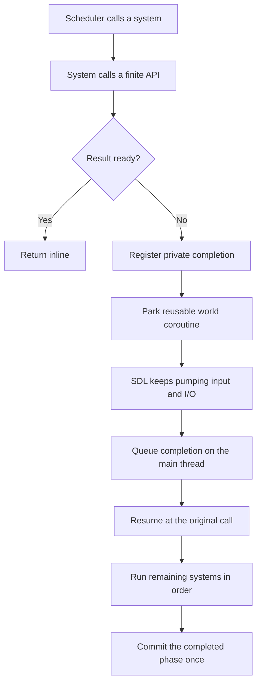

# Cooperative I/O

Tecs uses one style for finite work: call the operation and use its result. A
game does not choose between a callback, Future, Task, async suffix, or await
keyword.


```teal
world:addSystem({
    name = "game.LoadShips",
    phase = tecs.ecs.phases.Update,
    run = function()
        for entity, request in pendingShips:iter() do
            -- A cache hit returns inline. A miss resumes on this line after
            -- file acquisition and image decoding finish off the main thread.
            local image <const> = tecs.assets.loadImage(request.sprite)
            local sprite <const> = app.renderer.sprites:registerImage(image)

            world:set(entity, sprite)
            world:remove(entity, LoadShip)
        end
    end,
})
```

The call has the same signature outside a system:

```teal
local image <const> = tecs.assets.loadImage("sprites/player.png")
```

The context changes how Tecs waits, not what the API returns. An unresolved
operation parks the world's reusable logical-update coroutine when called by a
normal system. Startup, shutdown, and headless code block their caller while
driving the same private producer.

## A suspended system keeps its place

Systems still run in declared order. The first unresolved call parks the whole
logical update. SDL continues processing events and completion queues, but a
later system does not overtake the parked one and extraction never sees a
half-finished phase.



Deferred-only mutation is what makes this coherent. Archetypes do not publish
structural changes while a query is suspended, and only the scheduler commits
at phase boundaries.

## Coroutines wait; threads and reactors do work

Coroutines do not make a blocking decoder or disk syscall asynchronous. Tecs
routes work according to what it needs:

| Work                                                             | Execution place                |
| ---------------------------------------------------------------- | ------------------------------ |
| Cache hits, memory Readers, URI parsing, ECS and GPU publication | Main thread                    |
| TCP, UDP, timers, and pollable handles                           | Native `mio` readiness reactor |
| Bulk regular-file reads and writes                               | One bounded SDL AsyncIO queue  |
| File-backed HTTP request bodies                                  | Tokio HTTP file stream         |
| Opens, metadata, directories, and uncovered platform calls       | Bounded blocking-I/O lane      |
| Image decode and other expensive transformations                 | Separate bounded CPU lane      |

An asset miss therefore reads through SDL AsyncIO, decodes in the CPU lane,
publishes the result on the main thread, and resumes the system. A cache hit
does none of that work and touches no coroutine completion.

## Streams remain ordinary Readers and Writers

A Reader may be memory-backed, a process pipe, a socket, or a progressive HTTP
body. Its ordinary read call returns immediately when bytes are ready and waits
appropriately when they are not.

```teal
local client <const> = tecs.io.http.newClient()
local response <const> = client:send({
    url = assert(tecs.io.URI.new("https://example.com/levels/one")),
})

-- send returns when status and headers exist. Body storage is bounded, so a
-- slow consumer applies transport backpressure instead of buffering it all.
local scratch <const> = tecs.io.newBuffer(64 * 1024)
local reader <const> = assert(response.body:newReader())
while true do
    local count <const> = assert(reader:readInto(scratch, 0, 64 * 1024))
    if count == 0 then
        break
    end
    consume(scratch, count)
end
reader:close()
client:close()
```

Request bodies compose the same way. The client reads an arbitrary streaming
body inside client-owned cooperative work, so a socket, process pipe,
transform, or another HTTP body may wait without blocking SDL. On the SDL
storage backend, a file stream takes a more direct internal route: Tokio opens
the path and feeds Reqwest in bounded chunks without retaining the complete
file in Lua. Both paths use the same call:

```teal
local source <const> = assert(download.body:withMetadata("application/octet-stream"))
local uploaded <const> = client:send({
    url = assert(tecs.io.URI.new("https://example.com/uploads/one")),
    method = "PUT",
    body = source,
})
```

The upload work belongs to its client rather than to the system that started
it. A generic Reader uses a client-owned task; a native file body stays under
the client's Tokio request. This matters because `send` returns at response
headers while the bounded upload may still be applying transport backpressure.
Closing the client cancels and drains that work; application shutdown closes
any client that was not closed earlier.

`files.read`, `files.write`, file streams, socket operations, process pipes,
process waits, native dialogs, asset loads, and HTTP use this contextual wait
rule. There is no public process pump to remember.

## Continuous input is a service, not a forever wait

A finite read can complete, fail, time out, or be canceled. A file watcher or
platform event feed may continue forever, so the Application ingests those
sources into bounded queues and publishes their already received values during
`Ingress`. They do not park a world waiting for the next item.

Raw listeners, datagram sockets, and process output remain owned endpoints.
One `accept`, `receive`, or `read` is a finite call: it suspends when used in a
system and blocks its caller elsewhere. A plugin that wants one of those
endpoints to run continuously owns its lifetime and turns received values into
bounded ECS-visible state in an `Ingress` system. Tecs does not silently create
an unbounded background inbox.

SDL platform events use the same logical boundary. The host seals one retained
event batch when a logical update starts. Input is latched once, observers run
inside `Ingress`, and events arriving while an observer is suspended belong to
the next update. The active batch is released only after the update completes
or is canceled.

This preserves system and mutation order. External arrival time is still not a
deterministic simulation input, so rollback code records or supplies immutable
tick input and keeps unresolved I/O outside deterministic phases.
