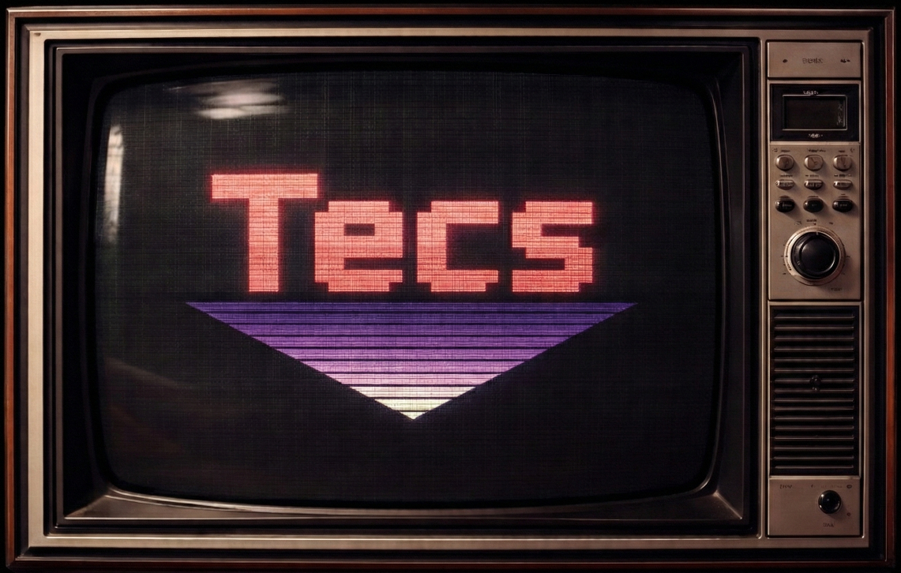

<!-- nupp:hero -->

# Build 2D games with Tecs + Nupp

Typed. GPU-driven. Built for humans and AI.

An entity component system and the game engine built around it.
Write your game in Nupp. Let Rust run the window, GPU, audio and physics.

[Get started](getting-started.md)
[Explore the API](modules/tecs/ecs/index.html)



<!-- /nupp:hero -->

<div class="tecs-features" aria-label="Tecs features">
  <section class="tecs-feature">
    <span class="tecs-feature-icon" aria-hidden="true">🤖</span>
    <h2>Build with AI</h2>
    <p>A built-in MCP server lets humans and agents inspect and edit a running game.</p>
  </section>
  <section class="tecs-feature">
    <span class="tecs-feature-icon" aria-hidden="true">⚡</span>
    <h2>Entities all the way down</h2>
    <p>An archetype-based ECS with contiguous columns and a dirty model the GPU reads.</p>
  </section>
  <section class="tecs-feature">
    <span class="tecs-feature-icon" aria-hidden="true">🔋</span>
    <h2>Batteries included</h2>
    <p>Physics, audio, lighting, text, sequences and animated sprites share the same world.</p>
  </section>
  <section class="tecs-feature">
    <span class="tecs-feature-icon" aria-hidden="true">✓</span>
    <h2>Static typing</h2>
    <p>Nupp checks component, query, system and engine contracts before your game runs.</p>
  </section>
  <section class="tecs-feature">
    <span class="tecs-feature-icon" aria-hidden="true">↕</span>
    <h2>Wait without frozen frames</h2>
    <p>Cooperative I/O parks work that must wait while the Rust host keeps the application alive.</p>
  </section>
</div>

## Entities are the interface

A drawn quad, a light, a sound, a physics body: each is an entity carrying
components. The subsystem that cares for it finds it by query. Snapshots save
world state, and the debug server inspects and edits it while the game runs.

```nupp
const world = tecs.ecs.newWorld()
world:spawn(tecs.ecs.Transform2D(120, 90, 0, 1, 0, 64, 64), tecs.gfx.Tint(1, 0.4, 0.2, 1), tecs.gfx.Renderable2D)
world:update(1 / 60)
```

## The shape of the tree

A game is a **component**: one compiled Nupp artifact exporting a session
constructor. The Rust host loads it, selects that export with `--entry`, and
drives it one frame at a time. Nothing dynamically requires game code, and no
native window handle crosses into it.

| Concern                                        | Owner                               |
| ---------------------------------------------- | ----------------------------------- |
| Game code, ECS semantics, extraction           | Nupp, in `src/tecs`                 |
| Window and event loop                          | Rust, with `winit`                  |
| GPU                                            | Rust, with `wgpu`                   |
| Audio, physics, gamepads                       | Rust services behind Tecs contracts |
| Tasks, files, bytes, JSON, networking, logging | The Nupp standard runtime           |

Tecs defers to Nupp. Anything the standard runtime already supplies is reached
directly rather than wrapped, so what is left in Tecs is Tecs-specific.

## Commands

Every command runs from the repository root and needs a
[Nupp compiler](https://github.com/nupp-lang/nupp) plus the Rust toolchain
`rust-toolchain.toml` pins.

```bash
nupp check --strict           # Type-check every Nupp source, strictly
nupp test                     # Build and run the test suites
nupp task ex-flatcolor           # Build a component and run it through the Rust host
nupp task ex-tiled               # TMX map with animated tiles and collision
nupp task ex-ui                  # Compose, Flex, Overlay and Scroll over a lit gradient field
nupp task ex-uistandalone        # Centered panel with scrollable controls
nupp task verify              # Every gate above, plus the Rust host
nupp build --target docs      # Render this site into out/docs
```

[Getting started](getting-started.md) walks through building the tree, running
an example, and writing a component of your own. Continue with
[Tiled maps](tiled/index.md) and [Building interfaces](ui/index.md).

## The reference

Every module's contracts live on its declarations, and the reference below is
rendered from them, so a signature has no second copy to drift from. Start at
[](tecs.ecs) for worlds, entities, components, queries, systems and states,
[](tecs.gfx) for what a frame draws, and [](tecs.application) for the lifecycle
a host drives.
