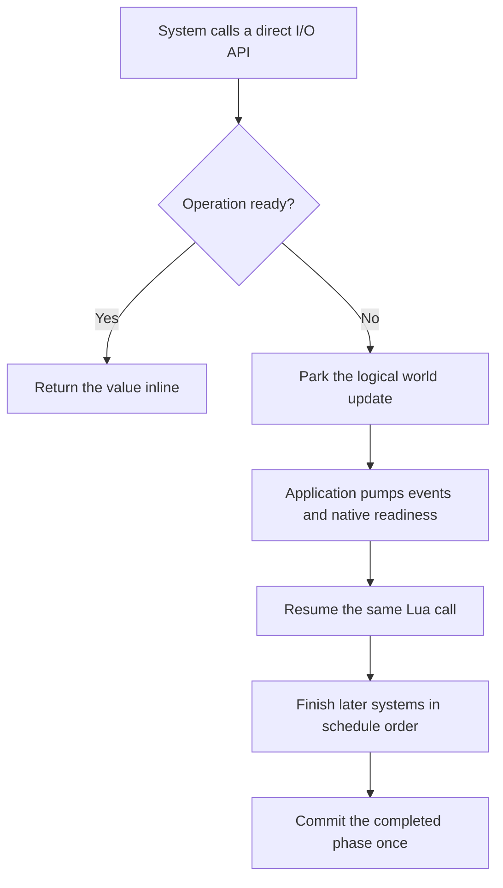

# Systems

A system runs one function in one [phase](/modules/ecs/phases). Build its query once
inside a plugin, then close over that query:

```teal
local Transform2D <const> = tecs.Transform2D

local function spinPlugin(world: tecs.World)
    local spinning <const> = world:newQuery({
        include = {Transform2D, Spin},
        type = "logic",
    })

    world:addSystem({
        name = "game.Spin",
        phase = tecs.ecs.phases.Update,
        run = function(dt: number)
            for archetype, length in spinning:iter() do
                local transforms <const> = archetype:getMut(Transform2D)
                local speeds <const> = archetype:get(Spin)

                for row = 1, length do
                    transforms[row].rotation =
                        transforms[row].rotation + speeds[row] * dt
                end
            end
        end,
    })
end

world:addPlugin(spinPlugin)
```

The pipeline calls `run(dt, world)`. Fixed phases supply the fixed timestep;
variable phases supply the frame delta.

## Asynchronous work

Every frame system dispatched by `world:update` is resumable. There is no
second system kind, explicit hold boundary, callback, or completion handle.
Call a cooperative engine function and use its returned value directly:

```teal
local record AssetBytes is tecs.ecs.Component
    bytes: string
end

tecs.ecs.newComponent({
    name = "game.AssetBytes",
    container = AssetBytes,
    fields = {"bytes"},
})

local function assetPlugin(): tecs.Plugin
    return function(world: tecs.World)
        local missing <const> = world:newQuery({include = {AssetPath}})
        world:addSystem({
            name = "game.LoadAsset",
            phase = tecs.ecs.phases.PreUpdate,
            run = function(_dt: number, runWorld: tecs.World)
                for archetype, length, entities in missing:iter() do
                    local paths <const> = archetype:get(AssetPath)
                    for row = 1, length do
                        local bytes <const> = tecs.assets.loadString(paths[row].path)
                        runWorld:set(entities[row], AssetBytes, AssetBytes(bytes))
                    end
                end
            end,
        })
    end
end
```

When the value is already available, the call returns inline and performs no
scheduler turn. When it must wait, Tecs parks the world update at that exact
Lua stack frame. Events and process-wide I/O continue to pump, and the
application may render the last completed frame. The next system and phase do
not run early.

The coroutine preserves query iterators and locals. Structural mutations stay
staged while the system is suspended because the system has not returned, so
a spawn after a wait remains ordered and commits at the next declared barrier.
The same mechanism works in fixed phases: the fixed step resumes without
replaying its earlier systems or advancing its clock twice.

Calling the same cooperative API outside a world update, including from
startup, shutdown, or `runPhase`, blocks while pumping its producer until it
has the same value. This is useful during initialization and in headless tools.
Plugin authors do not choose between synchronous and asynchronous variants.

One persistent coroutine belongs to the logical world update, not to every
entity. Iterating ten thousand entities does not create ten thousand tasks.
Only operations that actually wait enter the scheduler.

Cooperation does not make every byte operation asynchronous. The API follows
the kind of work:

| Work                                     | Behavior inside a system | Native execution            |
| ---------------------------------------- | ------------------------ | --------------------------- |
| Cached asset or ready socket             | Returns inline           | Immediate lookup or syscall |
| DNS resolution or TCP connection         | Suspends the update      | Bounded Tokio service       |
| Socket blocked on readiness              | Suspends the update      | Process-wide `mio` reactor  |
| HTTP request                             | Suspends the update      | Reqwest and Tokio service   |
| Asset decode                             | Suspends the update      | Bounded CPU lane            |
| Regular file transfer                    | Suspends the update      | SDL AsyncIO                 |
| `Process:wait` or native dialog          | Suspends the update      | Native completion bridge    |
| Memory Reader, Writer, or transform      | Returns inline           | Calling Lua thread          |
| Socket or process-pipe Reader and Writer | Suspends when not ready  | Native readiness reactor    |

CPU-heavy transforms and blocking libraries belong on workers. Users never
receive a future, poll a second nonblocking API, or manually manage a
coroutine.

Socket I/O uses the same direct form. This system does not poll, retain a
future, or declare itself asynchronous:

```teal
world:addSystem({
    name = "game.ReceivePacket",
    phase = tecs.ecs.phases.PreUpdate,
    run = function()
        tecs.scoped("decode packet", function(scope)
            local packet <const> = scope:own(assert(inbox:receive()))
            decodePacket(packet.bytes)
        end)
    end,
})
```

The native call runs first. A ready socket returns inline; only
`WouldBlock` reaches the scheduler:



## Frame placement

`Application` drives three groups:

| Call               | Work                                               |
| ------------------ | -------------------------------------------------- |
| `world:startup()`  | Runs startup phases after plugin registration.     |
| `world:update(dt)` | Runs fixed and variable frame phases.              |
| `world:shutdown()` | Runs teardown phases before subsystem destruction. |

Engine systems share the same schedule. `tecs.SyncRenderState` extracts the
world in `RenderFirst`, so a system that must affect the current frame runs no
later than `PostUpdate`.

`world:update` clears dirty bits after the pipeline. Dirty-gated consumers must
run in the same update as the writes they consume.

## Structural barriers

Systems in one phase share a structural transaction by default. The pipeline
publishes it after the phase, so they normally see the same committed
archetypes while the next phase sees their combined changes.

Declare `commitBefore = true` when a system must consume structural output
from an earlier system in the same phase. Declare `commitAfter = true` when a
later system in that phase must consume this system's structural output.
These declarations make unconditional dependencies visible in system
configuration.

Call `world:enqueueCommit()` inside a system for a conditional dependency. The
pipeline coalesces repeated requests and publishes after the requesting system
returns, before the next system runs. The requesting system keeps its current
view. Outside system dispatch, the same call publishes synchronously, which is
useful for tests and debug tooling.

Prefer moving the consumer to a later phase when that is the natural frame
dependency. Additional barriers reduce batching and make more archetype moves
observable within one phase.

## System failures

Under an application, the crash guard catches a system error, logs its
traceback, returns frame resources, and discards structural work staged by the
interrupted transaction. A crash never invents an undeclared publication
barrier. Simulation stops while the host continues to drain events and serve
the debug connection.

The pipeline protects one whole non-empty phase at a time rather than wrapping
each system separately. If a system raises, that phase guard clears its active
commit request before the stack unwinds while retaining the original traceback.
The next external `enqueueCommit()` is therefore synchronous as usual.

The guard restores engine invariants, not game invariants. A system may have
updated only part of a query before it threw. Development code may resume
through `app:clearCrash()` after inspection.

## Names and ordering

Give every system that participates in ordering or removal an explicit,
stable name:

```teal
world:addSystem({
    name = "game.ResolveDamage",
    phase = tecs.ecs.phases.PostUpdate,
    after = {"game.ApplyDamage"},
    before = {"tecs.PlaySounds"},
    run = resolveDamage,
})
```

Within one phase, the pipeline preserves registration order and then applies
`before` and `after` constraints. A missing target name contributes no edge,
which lets optional plugins declare ordering without requiring one another.
The pipeline rejects cycles and duplicate system names.

The pipeline generates a private name for an unnamed system. Treat that name
as engine-owned and unstable. `world:removeSystem(name)` requires an existing
name, so callers should remove only explicitly named systems.

## Conditional execution

`runIf(dt, world, systemName)` gates `run`. Any function with that shape may
serve as a predicate:

```teal
world:addSystem({
    name = "game.LowHealthWarning",
    phase = tecs.ecs.phases.Update,
    runIf = function(_dt: number, world: tecs.World): boolean
        return world.resources[PLAYER_HEALTH] < 25
    end,
    run = showLowHealthWarning,
})
```

`tecs.ecs.runif` supplies stateful predicates for common schedules.

### Delayed one-shot {#after}

`runif.after(delay)` waits for the named duration, allows one run, then removes
the system. The predicate uses the system name passed by the pipeline, so even
an unnamed one-shot can clean itself up.

### Repeating interval {#every}

`runif.every(interval, jitter?)` repeats on an interval. Jitter chooses the next
interval within the requested variance and draws from the world's
`"tecs.runif"` random stream. The stream makes schedules deterministic under
seeding and snapshots. Clamping keeps a large jitter from producing a
zero-length interval.

```teal
world:addSystem({
    name = "game.SpawnWave",
    phase = tecs.ecs.phases.Update,
    runIf = tecs.ecs.runif.every(0.5, 0.1),
    run = spawnWave,
})
```

### Immediate cooldown {#cooldown}

`runif.cooldown(duration)` allows the first update immediately, then suppresses
the system until the duration elapses.

### Active state {#instate}

`runif.inState(name)` allows the system only while that state occupies the top
of the [state stack](/modules/ecs/states):

```teal
runIf = tecs.ecs.runif.inState("game")
```

### Negation {#negate}

`runif.negate(predicate)` inverts one predicate.

### Conjunction {#both}

`runif.both(lhs, rhs)` short-circuits like logical AND. Operand order changes
stateful timing:

- `both(inState("game"), every(2))` pauses the interval outside the state.
- `both(every(2), inState("game"))` keeps the interval advancing and spends
  ticks that land outside the state.

Put a gate first when its false state should pause the timer.

### Disjunction {#either}

`runif.either(lhs, rhs)` short-circuits like logical OR. The right predicate
receives `dt` only when the left predicate returns false, so stateful operands
make order part of the schedule.

```teal
world:addSystem({
    name = "game.AmbientAnimation",
    phase = tecs.ecs.phases.Update,
    runIf = tecs.ecs.runif.either(
        tecs.ecs.runif.inState("game"),
        tecs.ecs.runif.inState("editor")
    ),
    run = animateAmbientScene,
})
```
