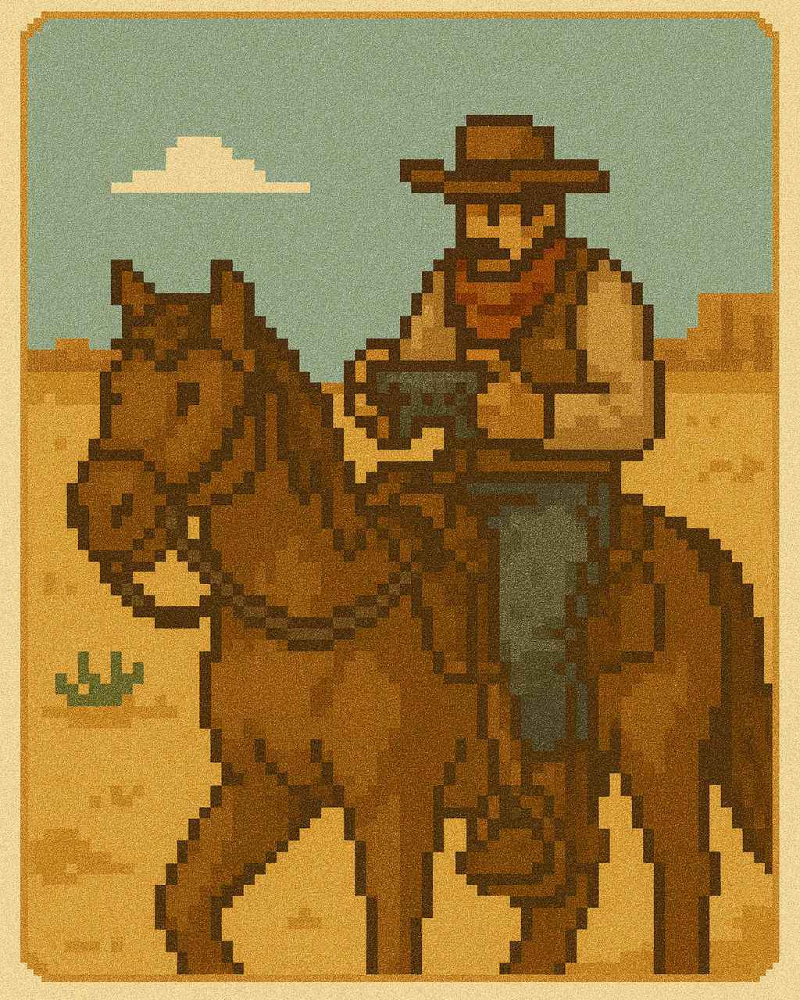

# Tecs Controller

Tecs Controller provides rebindable controls for Tecs games. It builds on top of Tecs2D's event-based
[input handling system](/tecs2d/input-handling) to add a layer of configurable controller mappings.

- **Rebindable controls**: Can change controls at runtime, and auto-detects joysticks
- **Multiple controllers**: Support for local multiplayer with multiple controllers
- **Multiple input sources**: Keyboard, mouse, gamepad buttons, axes, and joystick hats
- **Button pairs**: Define directional controls (like movement) as button pairs
- **Smart gamepad handling**: Flexible gamepad detection and auto-assignment

## How Controller Works with Tecs2D Input

While Tecs2D's built-in input handling provides low-level, event-driven access to keyboard, mouse, and gamepad inputs,
Controller adds:

- **Control abstraction**: Map game actions ("jump", "attack") to multiple physical inputs
- **Player-specific bindings**: Each player can have their own control scheme
- **Runtime rebinding**: Change controls without modifying code
- **Input unification**: Seamlessly combine keyboard, mouse, and gamepad inputs

::: tip Controller == logical input
Tecs2D Input handles the *physical* inputs efficiently, while Controller manages the *logical* mapping of those inputs
to game actions.
:::

## Installation

Controller is included as part of the Tecs framework. Simply require it in your project:

```lua
local controller = require("controller")
```

## Quick Start

```lua
local tecs = require("tecs")
local tecs2d = require("tecs2d")
local controller = require("controller")

local world = tecs.newWorld()

-- IMPORTANT: Add Tecs2D and Controller plugins
world:addPlugin(tecs2d.plugin())
world:addPlugin(controller.plugin())

-- Get the control manager from world resources
local controlManager = world.resources[controller.CONTROLLER]

-- Define control bindings
local bindings = {
    controls = {
        jump = {"key:space", "button:a"},
        attack = {"key:z", "mouse:1", "button:x"},
        menu = {"key:escape", "button:start"},
        dash = {"key:shift", "button:rightshoulder"},
        -- Direction controls for the movement pair
        left = {"key:a", "key:left", "axis:leftx-"},
        right = {"key:d", "key:right", "axis:leftx+"},
        up = {"key:w", "key:up", "axis:lefty-"},
        down = {"key:s", "key:down", "axis:lefty+"}
    },
    pairs = {
        move = {"left", "right", "up", "down"}
    }
}

-- Add a controller with auto-assignment enabled
local player1 = controlManager:addController(bindings, {auto = true})

-- In your game loop
if player1:isPressed("jump") then
    -- Player just pressed jump
end

if player1:isDown("attack") then
    -- Player is holding attack
end

local moveX, moveY = player1:getPair("move")
-- moveX is -1 (left), 0 (none), or 1 (right)
-- moveY is -1 (up), 0 (none), or 1 (down)
```

## Binding Format

Bindings are defined as strings in the format `source:value`. Each control can have multiple bindings.

::: info Based on baton
The binding system is based on [baton.lua](https://github.com/tesselode/baton) by Andrew Minnich, with the following
differences:

- Scancode inputs are not supported
- Raw axis support (axes without + or - suffix return full -1 to 1 range)
:::

### Keyboard Bindings

Use Love2D [KeyConstants](https://love2d.org/wiki/KeyConstant). For example:

| Binding        | Description      |
|----------------|------------------|
| `"key:space"`  | Spacebar         |
| `"key:w"`      | W key            |
| `"key:escape"` | Escape key       |
| `"key:lshift"` | Left shift key   |
| `"key:return"` | Enter/Return key |

### Mouse Bindings

Use mouse button numbers. For example:

| Binding     | Description          |
|-------------|----------------------|
| `"mouse:1"` | Left mouse button    |
| `"mouse:2"` | Right mouse button   |
| `"mouse:3"` | Middle mouse button  |
| `"mouse:4"` | Extra mouse button 1 |
| `"mouse:5"` | Extra mouse button 2 |

### Gamepad Button Bindings

Use Love2D [GamepadButton](https://love2d.org/wiki/GamepadButton) constants. For example:

| Binding                   | Description                          |
|---------------------------|--------------------------------------|
| `"button:a"`              | A button (Cross on PlayStation)     |
| `"button:b"`              | B button (Circle on PlayStation)    |
| `"button:x"`              | X button (Square on PlayStation)    |
| `"button:y"`              | Y button (Triangle on PlayStation)  |
| `"button:start"`          | Start button                         |
| `"button:back"`           | Back/Select button                   |
| `"button:guide"`          | Guide/Home button                    |
| `"button:leftshoulder"`   | Left shoulder button (L1/LB)         |
| `"button:rightshoulder"`  | Right shoulder button (R1/RB)        |
| `"button:leftstick"`      | Left stick click (L3)                |
| `"button:rightstick"`     | Right stick click (R3)               |
| `"button:dpup"`           | D-pad up                             |
| `"button:dpdown"`         | D-pad down                           |
| `"button:dpleft"`         | D-pad left                           |
| `"button:dpright"`        | D-pad right                          |

### Gamepad Axis Bindings

Use Love2D [GamepadAxis](https://love2d.org/wiki/GamepadAxis) constants. Axes can be used in two ways:

#### Directional Axes (with + or - suffix)
For digital-style input from analog axes (returns 0 to 1):

| Binding                 | Description            |
|-------------------------|------------------------|
| `"axis:leftx+"`         | Left stick right       |
| `"axis:leftx-"`         | Left stick left        |
| `"axis:lefty+"`         | Left stick down        |
| `"axis:lefty-"`         | Left stick up          |
| `"axis:rightx+"`        | Right stick right      |
| `"axis:rightx-"`        | Right stick left       |
| `"axis:righty+"`        | Right stick down       |
| `"axis:righty-"`        | Right stick up         |
| `"axis:triggerleft+"`   | Left trigger (L2/LT)   |
| `"axis:triggerright+"`  | Right trigger (R2/RT)  |

#### Raw Axes (no suffix)
For full analog range (returns -1 to 1):

| Binding                | Description                                      |
|------------------------|--------------------------------------------------|
| `"axis:leftx"`         | Left stick horizontal (-1 = left, 1 = right)    |
| `"axis:lefty"`         | Left stick vertical (-1 = up, 1 = down)         |
| `"axis:rightx"`        | Right stick horizontal (-1 = left, 1 = right)   |
| `"axis:righty"`        | Right stick vertical (-1 = up, 1 = down)        |
| `"axis:triggerleft"`   | Left trigger (0 to 1 typically)                 |
| `"axis:triggerright"`  | Right trigger (0 to 1 typically)                |

### Joystick Hat Bindings

For joystick hats, use the hat index followed by direction:

| Binding     | Description                |
|-------------|----------------------------|
| `"hat:1u"`  | Hat 1 up                   |
| `"hat:1d"`  | Hat 1 down                 |
| `"hat:1l"`  | Hat 1 left                 |
| `"hat:1r"`  | Hat 1 right                |
| `"hat:1lu"` | Hat 1 left-up diagonal     |
| `"hat:1ru"` | Hat 1 right-up diagonal    |
| `"hat:1ld"` | Hat 1 left-down diagonal   |
| `"hat:1rd"` | Hat 1 right-down diagonal  |
| `"hat:1c"`  | Hat 1 center (released)    |

## Button Pairs for Movement

Button pairs convert digital inputs (like keyboard keys or d-pad buttons) into analog-style movement values. They
make it easier to implement directional movement with digital controls.

A movement pair combines four directional controls into X/Y coordinates:

```lua
local bindings = {
    controls = {
        left = {"key:a", "key:left"},
        right = {"key:d", "key:right"},
        up = {"key:w", "key:up"},
        down = {"key:s", "key:down"}
    },
    pairs = {
        move = {"left", "right", "up", "down"}
    }
}

-- Get normalized movement direction
local moveX, moveY = controller:getPair("move")
-- moveX: -1 (left), 0 (none), or 1 (right)
-- moveY: -1 (up), 0 (none), or 1 (down)
```

### Pair Format

Button pairs must be defined with exactly 4 controls in a specific order:

```lua
pairs = {
    pairName = {left, right, up, down}
}
```

The indices are meaningful:
1. **Index 1**: Negative X direction (left)
2. **Index 2**: Positive X direction (right)
3. **Index 3**: Negative Y direction (up)
4. **Index 4**: Positive Y direction (down)

When you call `getPair()`, it returns:
- **X value**: -1 if left is pressed, +1 if right is pressed, 0 if neither/both
- **Y value**: -1 if up is pressed, +1 if down is pressed, 0 if neither/both

### Using Pairs for Player Movement

```lua
function PlayerMovementSystem:run(dt, world)
    local query = world:query({Player, Velocity})

    for arch, len in query() do
        local players = arch:getColumn(Player)
        local velocities = arch:getColumn(Velocity)
        for row = 1, len do
            local player = players[row]
            local velocity = velocities[row]
            -- Get movement from button pair
            local moveX, moveY = player.controller:getPair("move")

            -- Apply movement with player speed
            velocity.x = moveX * player.speed
            velocity.y = moveY * player.speed

            -- Normalize diagonal movement
            if moveX ~= 0 and moveY ~= 0 then
                velocity.x = velocity.x * 0.707  -- 1/sqrt(2)
                velocity.y = velocity.y * 0.707
            end
        end
    end
end
```

### Multiple Pairs for Different Actions

You can define multiple pairs for different types of movement:

```lua
local bindings = {
    controls = {
        -- Movement controls
        left = {"key:a"},
        right = {"key:d"},
        up = {"key:w"},
        down = {"key:s"},

        -- Camera controls
        camLeft = {"key:left"},
        camRight = {"key:right"},
        camUp = {"key:up"},
        camDown = {"key:down"},
    },
    pairs = {
        move = {"left", "right", "up", "down"},
        camera = {"camLeft", "camRight", "camUp", "camDown"},
    }
}

-- In game
local moveX, moveY = controller:getPair("move")
local camX, camY = controller:getPair("camera")
```

## Gamepad Support

Controller provides comprehensive gamepad support with automatic input mapping and hot-plugging capabilities.

### Creating Controllers with Gamepads

Controllers can be created with different auto-assignment modes:

```lua
local bindings = {
    controls = {
        jump = {"key:space", "button:a"},
        attack = {"key:x", "button:x"},
        -- Raw axes for full analog control
        moveX = {"axis:leftx"},  -- Returns -1 to 1
        moveY = {"axis:lefty"},  -- Returns -1 to 1
        aimX = {"axis:rightx"},  -- Returns -1 to 1
        aimY = {"axis:righty"}   -- Returns -1 to 1
    }
}

-- Add a controller with no gamepad
local controller1 = controlManager:addController(bindings)

-- Add a controller that auto-assigns a gamepad
local controller2 = controlManager:addController(bindings, {
    auto = true,
    deadzone = 0.25
})
```

Manually assigning a specific gamepad:

```lua
local joystick = love.joystick.getJoysticks()[1] -- First connected gamepad
local controller4 = controlManager:addController(bindings, {
    joystick = joystick,
    deadzone = 0.25
})
```

#### Auto-Assignment

Controller provides automatic gamepad assignment to simplify setup:

##### When auto=false (default)

- No automatic gamepad assignment
- Must manually assign gamepads

##### When auto=true

- Automatically assigns first available gamepad
- Prioritizes controllers with activity
- Reassigns to any available gamepad when disconnected

```lua
-- Player 1 gets first available gamepad (or active one if detected)
local player1 = controlManager:addController(bindings, {auto = true})

-- Player 2 gets next available gamepad
local player2 = controlManager:addController(bindings, {auto = true})
```

### Handling Gamepad Connection/Disconnection

When using the Controller plugin, gamepad hot-plugging is handled automatically:

```lua
-- The plugin automatically listens for joystick events
world:addPlugin(controller.plugin())
```

The plugin sets up a system that:

- Listens for `tecs2d.events.JoystickAdded` and `JoystickRemoved` events
- Auto-assigns new gamepads to controllers with `auto = true`
- Prioritizes controllers that have activity when assigning

### Switching Controllers

The `resetJoystick()` method allows changing controller assignments at runtime:

```lua
-- Enable auto-assignment
controller:resetJoystick({auto = true})

-- Disable auto-assignment
controller:resetJoystick({auto = false})

-- Switch to a specific gamepad
controller:resetJoystick({
    joystick = joysticks[2],
    deadzone = 0.3
})

-- Disconnect gamepad (keyboard-only mode)
controller:resetJoystick(nil)
```

### Programmatic Joystick Assignment

You can directly set a controller's joystick using the `setJoystick` method:

```lua
-- Assign a specific joystick
local joystick = love.joystick.getJoysticks()[1]
controller:setJoystick(joystick)

-- Clear the joystick
controller:setJoystick(nil)
```

The `setJoystick` method automatically triggers rumble feedback when a joystick is connected to help players identify
their controller.

### Controller Joystick Changes

You can monitor when a controller's joystick changes by setting an `onJoystickChanged` callback:

```lua
-- Set a callback to be notified of joystick changes
controller.onJoystickChanged = function(controller, newJoystick, oldJoystick)
    if newJoystick then
        print(string.format("Controller connected: %s", newJoystick:getName()))
    else
        print("Controller disconnected")
    end

    -- Update UI to show controller status
    updateControllerIcon(controller, newJoystick)
end
```

This callback is triggered whenever:
- A joystick is assigned (manually or automatically)
- A joystick is disconnected
- The controller switches to a different joystick

### Gamepad-Specific Features

#### Vibration/Rumble

```lua
-- Add rumble feedback on hit
if controller:isPressed("attack") and enemy:wasHit() then
    local joystick = controller.joystick
    if joystick and joystick:isVibrationSupported() then
        -- Vibrate for 0.2 seconds at 50% strength
        joystick:setVibration(0.5, 0.5, 0.2)
    end
end
```

#### Analog Triggers

```lua
local bindings = {
    controls = {
        accelerate = {"key:up", "axis:triggerright"},
        brake = {"key:down", "axis:triggerleft"}
    }
}

-- Get analog trigger values (0 to 1)
local acceleration = controller:getRaw("accelerate")
local braking = controller:getRaw("brake")

-- Apply to vehicle
vehicle.throttle = acceleration
vehicle.brakeForce = braking * vehicle.maxBrakeForce
```

## Advanced Usage

### Multiple Players

```lua
-- Define different bindings for each player
local player1Bindings = {
    controls = {
        jump = {"key:w", "button:a"},
        attack = {"key:space", "button:x"}
    }
}

local player2Bindings = {
    controls = {
        jump = {"key:up", "button:a"},
        attack = {"key:rctrl", "button:x"}
    }
}

-- Add controllers with auto mode for multiplayer
local player1 = controlManager:addController(player1Bindings, {
    auto = true,
    deadzone = 0.25
})

local player2 = controlManager:addController(player2Bindings, {
    auto = true,
    deadzone = 0.25
})
```

### Custom Dead Zones

Dead zones prevent analog stick drift from registering as input:

```lua
-- Create controller with custom dead zone (0.0 to 1.0)
local controller = controlManager:addController(bindings, {
    auto = "flexible",
    deadzone = 0.3  -- 30% dead zone
})
```

### Raw Values

Get the raw analog value of a control (useful for triggers and sticks):

```lua
-- For buttons and keys: returns 0 or 1
local jumpValue = controller:getRaw("jump")

-- For directional axes (with + or -): returns 0 to 1
local throttle = controller:getRaw("accelerate")  -- axis:triggerright+

-- For raw axes (no suffix): returns -1 to 1
local aimX = controller:getRaw("aimHorizontal")   -- axis:rightx
```

### Analog Stick Movement

For smooth analog movement without button pairs, you can directly bind analog axes:

```lua
local bindings = {
    controls = {
        -- Raw analog stick bindings (full -1 to 1 range)
        moveX = {"axis:leftx"},   -- Full horizontal axis
        moveY = {"axis:lefty"},   -- Full vertical axis
        aimX = {"axis:rightx"},   -- Right stick horizontal
        aimY = {"axis:righty"},   -- Right stick vertical

        -- Or use directional bindings (0 to 1 range)
        moveLeft = {"axis:leftx-"},
        moveRight = {"axis:leftx+"},
        moveUp = {"axis:lefty-"},
        moveDown = {"axis:lefty+"}
    }
}

-- Get smooth analog movement with raw axes
local moveX = controller:getRaw("moveX")  -- -1 to 1
local moveY = controller:getRaw("moveY")  -- -1 to 1

-- Apply to player velocity (deadzone already handled)
player.velocityX = moveX * player.speed
player.velocityY = moveY * player.speed

-- Get aim direction for twin-stick shooter
local aimX = controller:getRaw("aimX")  -- -1 to 1
local aimY = controller:getRaw("aimY")  -- -1 to 1
if math.abs(aimX) > 0.1 or math.abs(aimY) > 0.1 then
    player.aimAngle = math.atan2(aimY, aimX)
end
```

You can also combine analog sticks with keyboard fallback:

```lua
local bindings = {
    controls = {
        -- Keyboard and analog stick support
        left = {"key:a", "axis:leftx-"},
        right = {"key:d", "axis:leftx+"},
        up = {"key:w", "axis:lefty-"},
        down = {"key:s", "axis:lefty+"}
    },
    pairs = {
        move = {"left", "right", "up", "down"}
    }
}

-- Works with both keyboard (digital) and gamepad (analog)
local moveX, moveY = controller:getPair("move")
```

## API Reference

### JoystickConfig

The `JoystickConfig` type defines joystick assignment options:

```lua
type JoystickConfig = {
    joystick?: love.joystick.Joystick,  -- Specific gamepad to use
    auto?: boolean,  -- Enable auto-assignment (default: false)
    deadzone?: number  -- Axis deadzone threshold 0-1 (default: 0.5)
}
```

**Fields:**

- `joystick`: A specific Love2D joystick/gamepad to assign to the controller
- `auto`: Enable automatic gamepad assignment (default: false)
  - When `true`: Auto-assigns available gamepads, prioritizes controllers with activity
  - When `false`: Manual assignment only
- `deadzone`: Minimum axis value to register as input (prevents stick drift)

### Bindings

The `Bindings` type defines the structure for control mappings:

```lua
type Bindings = {
    controls: {string: {string}},  -- Map of control names to binding arrays
    pairs?: {string: {string}}     -- Optional map of pair names to 4 control names
}
```

**Fields:**

- `controls`: A table mapping control names (strings) to arrays of binding strings
  - Keys are control names like "jump", "attack", "moveLeft"
  - Values are arrays of binding strings like `{"key:space", "button:a"}`
- `pairs` (optional): A table mapping pair names to exactly 4 control names
  - Keys are pair names like "move", "aim"
  - Values must be arrays with exactly 4 control names: `{left, right, up, down}`

**Example:**

```lua
local bindings: Bindings = {
    controls = {
        jump = {"key:space", "button:a"},
        attack = {"key:z", "mouse:1"},
        left = {"key:a"},
        right = {"key:d"},
        up = {"key:w"},
        down = {"key:s"}
    },
    pairs = {
        move = {"left", "right", "up", "down"}
    }
}
```

### ControlManager

The `ControlManager` manages multiple controllers for different players in your game.

#### newManager

Creates a new control manager that uses the Tecs2D input system.

```lua
function controller.newManager(input: Input): ControlManager
```

- `input`: The Tecs2D Input instance to use for input events.

**Returns:**

- A new `ControlManager` instance.

**Example:**

```lua
local controlManager = controller.newManager()
```

#### addController

Adds a new controller with the specified bindings.

```lua
function ControlManager:addController(
    bindings: Bindings,
    config?: JoystickConfig
): Controller
```

- `bindings`: Table containing control mappings and button pairs.
- `config`: Optional joystick configuration:
  - `joystick`: Specific gamepad to use
  - `auto`: Enable auto-assignment (true/false, default: false)
  - `deadzone`: Dead zone threshold from 0 to 1 (default: 0.5)

**Returns:**

- The newly created `Controller` instance.

**Example:**

```lua
local bindings = {
    controls = {
        jump = {"key:space", "button:a"},
        attack = {"key:z", "button:x"}
    },
    pairs = {
        move = {"left", "right", "up", "down"}
    }
}

-- Manual mode (default)
local controller1 = controlManager:addController(bindings)

-- Auto-assignment enabled
local controller2 = controlManager:addController(bindings, {
    auto = true,
    deadzone = 0.25
})

-- Specific joystick assignment
local joystick = love.joystick.getJoysticks()[1]
local controller3 = controlManager:addController(bindings, {
    joystick = joystick,
    deadzone = 0.25
})

-- Specific joystick
local controller4 = controlManager:addController(bindings, {
    joystick = joystick,
    deadzone = 0.25
})
```

#### removeController

Removes a controller from the manager.

```lua
function ControlManager:removeController(controller: Controller)
```

- `controller`: The controller instance to remove.

**Example:**

```lua
controlManager:removeController(player2Controller)
```

#### `get`

Gets a controller by its index.

```lua
function ControlManager:get(index: integer): Controller
```

- `index`: The 1-based index of the controller.

**Returns:**

- The controller at the specified index, or nil if not found.

**Example:**

```lua
local player1 = controlManager:get(1)
local player2 = controlManager:get(2)
```

### Controller

The `Controller` represents a single player's input device with their control bindings.

#### isPressed

Checks if a button was just pressed this frame.

```lua
function Controller:isPressed(button: string): boolean
```

- `button`: The name of the button to check.

**Returns:**

- `true` if the button was just pressed, `false` otherwise.

**Notes:**

- Only returns true on the frame the button is first pressed.
- Will not return true while the button is held down.

**Example:**

```lua
if controller:isPressed("jump") then
    player:startJump()
end
```

#### isDown

Checks if a button is currently being held down.

```lua
function Controller:isDown(button: string): boolean
```

- `button`: The name of the button to check.

**Returns:**

- `true` if the button is currently down, `false` otherwise.

**Notes:**

- Returns true for every frame the button is held.
- Includes the initial press frame.

**Example:**

```lua
if controller:isDown("sprint") then
    player.speed = player.runSpeed
end
```

#### isReleased

Checks if a button was just released this frame.

```lua
function Controller:isReleased(button: string): boolean
```

- `button`: The name of the button to check.

**Returns:**

- `true` if the button was just released, `false` otherwise.

**Notes:**

- Only returns true on the frame the button is released.

**Example:**

```lua
if controller:isReleased("charge") then
    player:releaseChargedAttack()
end
```

#### getPair

Gets the directional input from a button pair.

```lua
function Controller:getPair(name: string): number, number
```

- `name`: The name of the button pair.

**Returns:**

- `x`: Horizontal direction (-1 for left, 0 for neutral, 1 for right).
- `y`: Vertical direction (-1 for up, 0 for neutral, 1 for down).

**Notes:**

- Button pairs must be defined in the bindings with exactly 4 buttons: left, right, up, down.
- Opposite directions cancel out (e.g., pressing both left and right returns 0).

**Example:**

```lua
local moveX, moveY = controller:getPair("move")
velocity.x = moveX * player.speed
velocity.y = moveY * player.speed
```

#### getRaw

Gets the raw numeric value of a control.

```lua
function Controller:getRaw(button: string): number
```

- `button`: The name of the control to check.

**Returns:**

- For buttons, keys, and hats: 0 when not pressed, 1 when pressed
- For directional axes (with + or -): 0 to 1 based on axis position
- For raw axes (without suffix): -1 to 1 for the full axis range

**Notes:**

- Useful for analog controls like triggers or thumbsticks.
- Values within the dead zone return 0.

**Example:**

```lua
local throttle = controller:getRaw("accelerate")
car.acceleration = throttle * car.maxAcceleration
```

#### rebind

Changes the controller's bindings at runtime.

```lua
function Controller:rebind(bindings: Bindings)
```

- `bindings`: The new binding configuration to apply.

**Notes:**

- Useful for implementing control remapping in settings menus.
- Preserves the controller's joystick and deadzone settings.
- Clears all previous bindings before applying new ones.

**Example:**

```lua
-- In a settings menu
local function remapJumpKey(newKey: string)
    local currentBindings = player1Controller.bindings
    currentBindings.controls.jump = {"key:" .. newKey, "button:a"}
    player1Controller:rebind(currentBindings)
end

-- Complete rebinding
local newBindings = {
    controls = {
        jump = {"key:w", "button:a"},
        attack = {"key:q", "button:x"}
    },
    pairs = {
        move = {"left", "right", "up", "down"}
    }
}
player1Controller:rebind(newBindings)
```

#### setJoystick

Directly sets the joystick for this controller.

```lua
function Controller:setJoystick(joystick: love.joystick.Joystick)
```

- `joystick`: The joystick to assign, or nil to clear.

**Notes:**

- Automatically triggers rumble feedback when a joystick is assigned
- Calls the `onJoystickChanged` callback if set
- Does not change the auto-assignment setting

**Example:**

```lua
-- Assign a specific joystick
local joystick = love.joystick.getJoysticks()[1]
controller:setJoystick(joystick)

-- Clear the joystick
controller:setJoystick(nil)
```

#### resetJoystick

Resets or changes the joystick assignment for the controller.

```lua
function Controller:resetJoystick(config?: JoystickConfig)
```

- `config`: Optional joystick configuration:
  - `joystick`: Specific gamepad to use
  - `auto`: Enable auto-assignment (true/false)
  - `deadzone`: Dead zone threshold from 0 to 1
  - `nil`: Disconnect gamepad and disable auto mode

**Notes:**

- Useful for switching controllers or changing modes at runtime
- Clears previous GUID assignment when changing modes
- Can update deadzone without changing joystick

**Example:**

```lua
-- Enable auto-assignment
controller:resetJoystick({auto = true})

-- Disable auto-assignment
controller:resetJoystick({auto = false})

-- Switch to specific gamepad
local joysticks = love.joystick.getJoysticks()
controller:resetJoystick({
    joystick = joysticks[2],
    deadzone = 0.3
})

-- Disconnect gamepad (keyboard only)
controller:resetJoystick(nil)
```

### Controller Properties

#### onJoystickChanged

Optional callback function that's called when the controller's joystick changes.

```lua
Controller.onJoystickChanged: function(
    controller: Controller,
    newJoystick: love.joystick.Joystick,
    oldJoystick: love.joystick.Joystick
)
```

**Parameters:**

- `controller`: The controller whose joystick changed
- `newJoystick`: The new joystick (nil if disconnected)
- `oldJoystick`: The previous joystick (nil if was disconnected)

**Example:**

```lua
controller.onJoystickChanged = function(ctrl, newJoy, oldJoy)
    if newJoy then
        print("Controller connected: " .. newJoy:getName())
        updateControllerUI(ctrl, newJoy)
    else
        print("Controller disconnected")
        showKeyboardControlsUI(ctrl)
    end
end
```

**Example:**

```lua
-- Listen for controller reassignments
world:observe(controller.ControllerReassigned, function(event)
    -- Notify player
    showNotification(string.format(
        "Controller switched from %s to %s",
        event.oldName,
        event.newName
    ))

    -- Update UI button prompts
    if event.newName:match("Xbox") then
        setButtonPrompts("xbox")
    elseif event.newName:match("PlayStation") or event.newName:match("PS") then
        setButtonPrompts("playstation")
    end
end)
```

## Integration with Tecs

Controller provides a built-in plugin that integrates with Tecs2D's event system:

### Using the Plugin

```lua
local tecs = require("tecs")
local tecs2d = require("tecs2d")
local controller = require("controller")

local world = tecs.newWorld()

-- Add Tecs2D first (provides input system)
world:addPlugin(tecs2d.plugin())

-- Add Controller plugin (automatically sets up event handling)
world:addPlugin(controller.plugin())

-- The control manager is now available in world resources
local controlManager = world.resources[controller.CONTROLLER]

-- Set up player controls
local bindings = {
    controls = {
        jump = {"key:space", "button:a"},
        attack = {"key:z", "mouse:1", "button:x"},
        left = {"key:a", "axis:leftx-"},
        right = {"key:d", "axis:leftx+"},
        up = {"key:w", "axis:lefty-"},
        down = {"key:s", "axis:lefty+"}
    },
    pairs = {
        move = {"left", "right", "up", "down"}
    }
}

-- Add controller with flexible auto-assignment
local player1Controller = controlManager:addController(bindings, {auto = "flexible"})

-- Create player control system
world:addSystem({
    name = "PlayerControlSystem",
    phase = tecs.phases.Update,
    run = function(dt: number)
        local query = world:query({Player, Velocity})

        for arch, len in query() do
            local players = arch:getColumn(Player)
            local velocities = arch:getColumn(Velocity)
            for row = 1, len do
                local player = players[row]
                local velocity = velocities[row]
                -- Get movement input
                local moveX, moveY = player1Controller:getPair("move")
                velocity.x = moveX * player.speed
                velocity.y = moveY * player.speed

                -- Handle jumping
                if player1Controller:isPressed("jump") and player.grounded then
                    velocity.y = -player.jumpPower
                end

                -- Handle attacks
                if player1Controller:isPressed("attack") then
                    -- Spawn attack entity or trigger attack animation
                end
            end
        end
    end
})
```

### Plugin Configuration

You can provide a custom control manager to the plugin:

```lua
-- Create custom control manager
local customManager = controller.newManager()

-- Configure the manager as needed
customManager:addController(player1Bindings, true)
customManager:addController(player2Bindings, true)

-- Use the custom manager with the plugin
world:addPlugin(controller.plugin({
    manager = customManager
}))
```