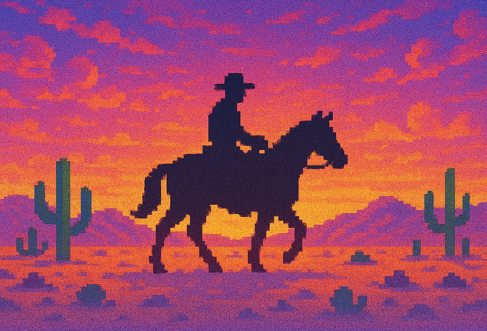

# Tecs Render



Tecs Render is a camera and 2D rendering pipeline for Tecs2D that provides deferred rendering with automatic sorting,
culling, and lighting effects.

- **Render pipeline**: Queue draw calls for efficient batched rendering and depth sorting
- **Pixel-perfect camera**: Virtual resolution system with letterboxing and smooth zoom
- **Smooth camera movement**: Built-in lerping for smooth camera movement
- **Lighting**: Lightmap-based lighting with ambient light and light sources
- **Optimized performance**: Uses Structure of Arrays (SoA) for better cache locality and reduced memory usage

## Installation

You can install Tecs_render using LuaRocks:

```bash
luarocks install --tree=src/vendor tecs_render.tl
```

::: info Installation help
See the [install](/guide/install) guide for more info
:::

## Quick Start

```lua
local tecs = require("tecs")
local render = require("tecs_render")

local world = tecs.newWorld()

-- Create the render pipeline and register it with world
local pipeline = render.newPipeline({
    world = world,
    camera = render.newCamera({
        minWidth = 320,
        height = 200
    })
})

-- Find entities that have the Transform and Sprite component
local spriteQuery = world:query({
    include = {tecs.builtins.Transform, Sprite}
})

-- Add systems to the Render phase to draw stuff
world:addSystem(tecs.phases.Render, function()
    for archetype, len in spriteQuery() do
        local transforms = archetype[tecs.builtins.Transform]
        local sprites = archetype[Sprite]
        for row = 1, len do
            local transform = transforms[i]
            local sprite = sprites[i]
            pipeline:drawTransform(
                transform,          -- provides layer, x, y
                sprite.width,       -- width: used for culling
                sprite.height,      -- height: used for culling
                love.graphics.draw, -- function to call if in view
                sprite,             -- arguments to pass if called...
                transform.x,
                transform.y
            )
        end
    end
end)
```

## Core Concepts

### Render Pipeline

The render pipeline collects draw calls during the [render group phases](/reference/phases#rendergroup) and renders
them all at once during at the end of the phase group, properly sorted and with lighting applied. Queue up draw calls
in these render phases, and the render pipeline takes care of efficiently drawing what's visible to the camera.

- **Deferred rendering**: Draw calls are queued and rendered later
- **Frustum culling**: Only draws what's visible to the camera
- **Automatic sorting**: Sort draws by layer, then z-depth, and finally bottom y-position (this can be changed)
- **Lighting**: Optional lightmap based lighting system

### Camera System

A camera is attached to the render pipeline. It handles:

- **Virtual resolution**: Maintains consistent game dimensions across different screen sizes
- **Letterboxing**: Automatic letterboxing to maintain aspect ratio
- **Oversample for zoom**: Canvas oversample factor can provide extra detail when zooming out
- **Smooth movement**: Built-in lerping for smooth camera movement (enabled by default)
- **Zooming**: Smooth zoom in/out with configurable limits
- **Widescreen support**: Height is fixed, but width can vary to provide better widescreen monitor support

::: details Cameras and render pipelines
The render pipeline uses the attached camera for culling. The camera is responsible for transforming the things
drawn by the render pipeline and presenting them. While a render pipeline can have only one attached camera at a
time, you _could_ implement multiple camera support by implementing the Camera interface.
:::

### Oversampling

The `oversample` parameter controls how much extra detail the camera renders compared to the virtual dimensions. This
allows for a game to zoom out past the virtual dimensions of the game without losing detail. This is useful for things
like panning over a level, or a map editor.

- `oversample = 1`: Canvas size = virtual size (no extra detail)
- `oversample = 2`: Canvas size = 2x virtual size (2x extra detail when zooming out)
- `oversample = 3`: Canvas size = 3x virtual size (3x extra detail when zooming out)

::: details How it works
Tecs_Render draws to an offscreen canvas that is the size of your virtual dimensions multiplied by the oversample
factor. A quad is used to render only the visible part of the offscreen canvas, determined by the current zoom level
of a camera.
:::

## OnDraw Event

The render pipeline provides an optional event system that allows you to react when draw calls are created.
The `OnDraw` event is only emitted if the draw was not culled and if there are listeners for it, making it zero-cost
when not used.

### OnDraw use case

Say you're spawning a fireball entity that adds some lighting around it. You might want the sprite
associated with the fireball to be "unlit", meaning it's not affected by dim lighting and always renders in full
color. You don't want your sprite rendering systems to know about fireballs, so the event system can be used to
connect the logic while still keeping it decoupled. The `OnDraw` event can be used in this situation to mutate a draw
after it's created using an event that's decoupled from the emitter of the event.

### Using OnDraw Events

To listen for OnDraw events, entities need an `Emitter` component and an observer for the `OnDraw` event:

```lua
local render = require("tecs_render")

local entity = world:spawn({
    tecs.builtins.Emitter(function(emitter: tecs.Emitter)
        emitter:observe(render.OnDraw, function(event: render.OnDraw)
            -- Make fireballs not impacted by lighting
            event.pipeline:setDrawFlag(event.drawId, render.UNLIT_FLAG)
        end)
    end),
})
```

Later, when doing actual draws in your systems, call `pipeline:emitOnDraw`:

```lua
-- In your rendering system
for archetype, len in spriteQuery() do
    for row = 1, len do
        local drawId = pipeline:draw(layer, x, y, w, h, drawFunction)
        pipeline:emitOnDraw(archetype, row, drawId)
    end
end
```

### Built-in Observer: UNLIT_OBSERVER

Tecs_render provides a built-in observer that automatically makes draws unlit (not affected by lighting).
So the earlier fireball example can be made more performant:

```lua
local entity = world:spawn({
    tecs.builtins.Emitter(function(emitter: tecs.Emitter)
        emitter:observe(render.OnDraw, render.UNLIT_OBSERVER)
    end),
})
```

### Performance Notes

- The OnDraw event is only emitted if the archetype has an emitter and there are observers listening for the event
- If no entity has observers for `OnDraw`, calling `emitOnDraw` has minimal overhead
- Events use a pooled instance to avoid allocations, so don't hold onto events after the callback completes

## Render Pipeline API

### Creating a Pipeline

Creating a new render pipeline also registers it as a plugin with the world.

```lua
local pipeline = render.newPipeline({
    world = world,
    camera = render.newCamera({
        minWidth = 320,
        height = 200
    }),
    sortFunction = customSortFunction  -- Optional custom sort
})
```

### Queuing Draw Calls

All draw methods return an integer ID that can be used to modify the draw:

```lua
-- Basic draw call with position and size
local drawId = pipeline:draw(
    layer,          -- integer: 1-16, or a layer name string
    x, y,           -- position
    width, height,  -- bounds for culling
    drawFunction,   -- function to call
    ...             -- arguments to pass
)

-- Modify the draw using its ID
pipeline:setDrawFlag(drawId, render.UNLIT_FLAG)
pipeline:addDrawShader(drawId, myShader)
pipeline:setDrawZ(drawId, 5)
```

### Layers

All drawing operations are applied to _layers_. The render pipeline supports 1-16 layers, where layer 1 is rendered
first, followed by layer 2 on top, and so on. Layers can be referred to by index or by a user-defined name.

### Drawing with Transform Components

For entities with [Transform components](/reference/builtins#transform-component), use `drawTransform` for convenience,
which passes the `layer`, `x`, `y`, and `z` of the entity.

```lua
local transform = world:get(entity, tecs.builtins.Transform)
pipeline:drawTransform(transform, w, h, drawFunction)
```

### Drawing Lights

Lights are drawn to a separate, per/layer lightmap and also return an ID:

```lua
local lightId = pipeline:drawLight(layer, x, y, w, h, function()
    -- Draw your light here
    love.graphics.setColor(1, 1, 1, 0.5)
    love.graphics.circle("fill", x, y, radius)
end)
```

* Lights only affect draws on the same layer. They do not affect draws on layers above or below.
* If ambient light is set to `0, 0, 0`, then draws do not appear unless light pixels are drawn to add light to the
  draws.

### Absolute Drawing

Absolute draws are used to render UI and HUD elements that should ignore camera transformations, but still use
pixel perfect rendering based on virtual dimensions.

```lua
local id = pipeline:drawAbsolute(function()
    love.graphics.print("Score: " .. score, 10, 10)
end)
```

### Emitting OnDraw Events

After creating a draw call, you can emit an OnDraw event to notify any observers. This is typically done in rendering
systems when iterating through query results:

```lua
-- In a rendering system
for archetype, len in spriteQuery() do
    for row = 1, len do
        local drawId = pipeline:draw(layer, x, y, w, h, drawFunction)
        pipeline:emitOnDraw(archetype, row, drawId)
    end
end
```

See the [OnDraw Event](#ondraw-event) section for more details.

### Lighting Control

Lighting is enabled by default. You can enable or disable lighting using:

```lua
pipeline:enableLighting()
pipeline:disableLighting()
```

The ambient light level is set to `1, 1, 1` by default, meaning full light. You can change this using:

```lua
pipeline:setAmbientLight(0.1, 0.1, 0.15)
```

You can get the current ambient light using:

```lua
local r, g, b = pipeline:getAmbientLight()
```

## Camera API

### Creating a Camera

```lua
local camera = render.newCamera({
    minWidth = 320,         -- Minimum virtual width
    maxWidth = 640,         -- Maximum virtual width (default: no limit)
    height = 200,           -- Fixed virtual height
    oversample = 2,         -- Canvas oversample factor
    scaleMode = "pixel",    -- Scaling mode (default: "pixel")
    lerpingEnabled = true,  -- Smooth camera movement (default: true)
    lerpSpeed = 8.0         -- Lerp speed factor (default: 8.0)
})
```

#### Scale modes

| Name | Description |
|------|-------------|
| `pixel` | Integer scaling for pixel-perfect rendering (default). Uses nearest-neighbor filtering for crisp pixels. Best for pixel art and retro-style games |
| `aspect` | Maintain aspect ratio with smooth scaling. Uses linear filtering for smooth gradients. Best for high-resolution art or when smooth scaling is desired |
| `none` | 1:1 rendering, centered on screen |

### Camera Coordinate System

**Important:** Tecs cameras use **center-based positioning**. When you set the camera position, you're setting the
center point of the camera's view, not the top-left corner.

```lua
camera:setPosition(100, 50)
```

### Camera Controls

```lua
-- Set camera position (world coordinates, CENTER of view)
camera:setPosition(x, y)

-- Teleport camera immediately (ignores lerping)
camera:teleport(x, y)

-- Get current position (CENTER of view)
local x, y = camera:getPosition()

-- Set zoom (1 = normal, 0.5 = 2x zoom in, 2 = 2x zoom out)
camera:setZoom(zoomLevel)

-- Get current zoom
local zoom = camera:getZoom()

-- Enable position clamping (prevents showing negative world coordinates)
camera:setClamp(true)
```

### Smooth Camera Movement

Cameras support smooth movement through linear interpolation (lerping).

```lua
-- Toggle smooth camera movement
camera:setLerpingEnabled(true)
camera:setLerpingEnabled(false)

-- Adjust lerp speed
camera:setLerpSpeed(8.0)  -- Default: 8.0
camera:setLerpSpeed(3.0)  -- Very smooth but slow
camera:setLerpSpeed(15.0) -- Snappy, quick response
```

### Coordinate Conversion

```lua
-- Convert world coordinates to screen coordinates
local screenX, screenY = camera:toScreen(worldX, worldY)

-- Convert screen coordinates to world coordinates
local worldX, worldY = camera:toWorld(screenX, screenY)

-- Get visible world bounds
local left, top, right, bottom = camera:getVisibleCorners()

-- Check if something is visible
local visible = camera:isVisible(x, y, width, height)
```

## Draw Flags

Control how individual draw calls are rendered using bitwise flags.

::: tip These are bit flags
Flags are combined using `bit.bor()`.
:::

```lua
-- Individual flags (these are integer constants)

-- Skip lighting for this draw
render.UNLIT_FLAG

-- Use absolute positioning
render.ABSOLUTE_FLAG

-- (internal) this is a light source (set automatically for lights)
render.LIGHT_FLAG

-- Setting flags one at a time (automatically ORs with existing flags)
local drawId = pipeline:draw(...)
pipeline:setDrawFlag(drawId, render.UNLIT_FLAG)     -- Adds this flag
pipeline:setDrawFlag(drawId, render.ABSOLUTE_FLAG)  -- Adds this flag too

-- Setting multiple flags at once (replaces all flags)
local bit = require("bit")
local flags = bit.bor(render.UNLIT_FLAG, render.ABSOLUTE_FLAG)
pipeline:setDrawFlags(drawId, flags)  -- Note: setDrawFlags (plural)

-- Removing a flag
pipeline:removeDrawFlag(drawId, render.UNLIT_FLAG)

-- Checking if a flag is set
if pipeline:hasDrawFlag(drawId, render.UNLIT_FLAG) then
    -- Draw is unlit
end

-- Adding a shader to a draw
pipeline:addDrawShader(drawId, myShader)

-- Default: flags start at 0 (no flags set)
```

## Layers

### Layer Naming

You can name layers for more readable code:

```lua
-- Name your layers
pipeline:nameLayer(1, "background")
pipeline:nameLayer(2, "terrain")
pipeline:nameLayer(5, "entities")
pipeline:nameLayer(10, "effects")
pipeline:nameLayer(15, "ui")

-- Use names instead of numbers
pipeline:draw("entities", x, y, w, h, drawSprite, sprite)
pipeline:drawLight("effects", lightX, lightY, 100, 100, drawLight)
```

### Layer Visibility

You can toggle layer visibility for debugging or special effects:

```lua
-- Hide a layer by number or name
pipeline:setLayerVisibility(2, false)
pipeline:setLayerVisibility("debug", false)

-- Show a layer by number or name
pipeline:setLayerVisibility(2, true)
pipeline:setLayerVisibility("debug", true)

-- Check if layer is visible
if pipeline:isLayerVisible("entities") then
    -- Layer is visible
end
```

### Layer Decorators

Layer decorators allow you to completely customize how a specific layer is rendered. Instead of the standard
"draw lights, then draws" process, you can intercept and control every aspect of the layer's rendering.

#### What are decorators for?

* **Layer-wide effects**: Apply shaders, blend modes, or post-processing to an entire layer at once, rather than
  individual draws.
* **Performance optimizations**: Batch similar operations, reduce state changes, or skip unnecessary rendering steps.
* **Selective lighting**: Skip lighting for certain layers (like UI), or implement custom lighting models.

#### How decorators work

When you set a decorator on a layer, the render pipeline calls your function instead of its default rendering logic.
Your decorator receives:

- **`camera`**, **`layer`**, **`pipeline`**: Context for rendering
- **`drawLights()`**: Function to render all lights on this layer
- **`drawRenders()`**: Function to render all draw calls on this layer

You control when (or if) to call these functions, and what graphics state to set around them.

#### Applying a decorator

```lua
pipeline:setLayerDecorator("effects", function(
    camera: render.Camera,
    layer: render.Layer,
    pipeline: render.Pipeline,
    drawLights: function(render.Camera, render.Layer, render.Pipeline),
    drawRenders: function(render.Camera, render.Layer, render.Pipeline)
)
    -- Pre-processing: set up graphics state
    love.graphics.setBlendMode("add")

    -- Render the layer content
    drawLights(camera, layer, pipeline)  -- Render lights
    drawRenders(camera, layer, pipeline) -- Render draws

    -- Post-processing: clean up graphics state
    love.graphics.setBlendMode("alpha")
end)
```

Remove a decorator by setting it to `nil`:

```lua
pipeline:setLayerDecorator("effects", nil)
```

### Accessing the Pipeline

You get the pipeline directly when creating it:

```lua
-- Create pipeline and keep a reference
local pipeline = render.newPipeline({
    world = world,
    camera = camera
})
```

You can also access it later via the world resources:

```lua
-- Access the pipeline from world resources
local pipeline = world.resources[render.PIPELINE]

function MySystem:update(dt)
    -- Use the retrieved pipeline
    pipeline:draw(...)
end
```

### Custom Sorting

Provide a custom sort function for special rendering orders. The sort function receives draw IDs and the pipeline for
accessing draw data:

```lua
local function customSort(a, b, pipeline)
    -- Sort by your own criteria
    -- a and b are draw IDs, use pipeline:getDrawData() to access fields
    local ax, ay, _, _, _, _, _, aflags = pipeline:getDrawData(a)
    local bx, by, _, _, _, _, _, bflags = pipeline:getDrawData(b)

    -- Example: Sort by y position for depth
    if ay ~= by then
        return ay < by
    end

    -- Then by x position
    return ax < bx
end

local pipeline = render.newPipeline({
    world = world,
    camera = camera,
    sortFunction = customSort
})
```

::: tip
The `getDrawData` method returns: `x, y, w, h, f, args, shaders, flags`
You can use underscore `_` to ignore values you don't need.

For more targeted access, use the specific methods:
- `getDrawCoordinates(id)` returns: `x, y, w, h`
- `getDrawFunction(id)` returns: `drawFunction, args`
- `getDrawModifiers(id)` returns: `shaders, flags`
:::
