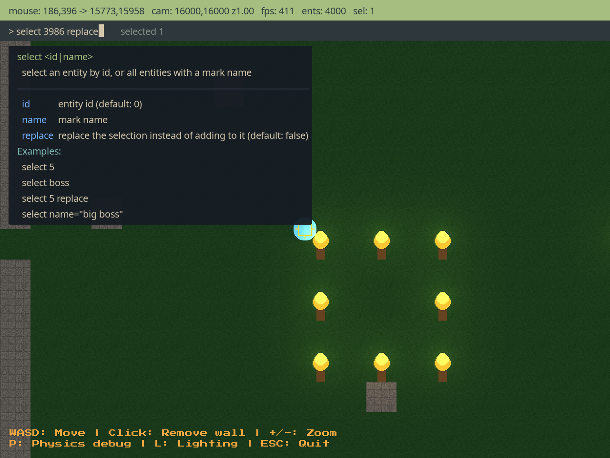

<!-- Generated by `make docs-debug` from the debugger command registry. Do not edit by hand. -->

# Debugger Commands

Every command below is typeable in the [in-game debugger](./debug) (see
[command syntax](./debug#command-syntax)); those marked with a tool name are also callable
over [MCP](./mcp/tools) as `cmd_*` tools, with the same arguments as JSON parameters and the
result data wrapped as `{ok = true, result = {...data, message}}`.

This page is generated: run `make docs-debug` after changing a command.

## Select

Find, select, mark, and annotate entities.

| Command | Description |
| --- | --- |
| [`select`](#cmd-select) | Select an entity by id, or all entities with a mark name. |
| [`clear`](#cmd-clear) | Clear the selection, message, and drag area. |
| [`mark`](#cmd-mark) | Name the selected entities so select, goto, and despawn can recall them by name. |
| [`goto`](#cmd-goto) | Move the camera to an entity by id, or the first with a mark name. |
| [`note`](#cmd-note) | Annotate the selected entities for the agent; empty message clears. |
| [`info`](#cmd-info) | Show an entity's components; defaults to the first selected. |
| [`despawn`](#cmd-despawn) | Despawn an entity by id or mark name, given ids, or the whole selection. |
| [`query`](#cmd-query) | Select entities matching a component query: Foo has it, -Foo lacks it. |
| [`ids`](#cmd-ids) | Toggle entity id labels over on-screen entities. |

### `select <id|name> [replace]` {#cmd-select}

Select an entity by id, or all entities with a mark name.

Add an entity (by id) or a marked group (by name) to the operator-visible selection; replace=true swaps the selection instead. Selected entities are highlighted in-game. Returns the selection size. Follow with cmd_info for component data or cmd_note to annotate.



MCP tool: `cmd_select`

| Argument | Type | Description |
| --- | --- | --- |
| `id` | number | entity id |
| `name` | string | mark name |
| `replace` | boolean | replace the selection instead of adding to it (default: false) |

::: details Result data schema
```json
{
  "properties": {
    "added": {
      "description": "entity ids added to the selection",
      "items": {
        "type": "integer"
      },
      "type": "array"
    },
    "selected": {
      "description": "selection size after the call",
      "type": "integer"
    }
  },
  "required": [
    "added",
    "selected"
  ],
  "type": "object"
}
```
:::

```
select 5
select boss
select 5 replace
select name="big boss"
```

### `clear` {#cmd-clear}

Clear the selection, message, and drag area.

MCP tool: `cmd_clear`

::: details Result data schema
```json
{
  "properties": {
    "selected": {
      "description": "always 0",
      "type": "integer"
    }
  },
  "required": [
    "selected"
  ],
  "type": "object"
}
```
:::

### `mark [name]` {#cmd-mark}

Name the selected entities so select, goto, and despawn can recall them by name.

Name the currently selected entities so later commands (select, goto, despawn, diff entity=) can address the group by that name. Marks survive until cleared. Returns the marked count.

MCP tool: `cmd_mark`

| Argument | Type | Description |
| --- | --- | --- |
| `name` | string | mark name; omit to unmark the selection |

::: details Result data schema
```json
{
  "properties": {
    "marked": {
      "description": "entities marked",
      "type": "integer"
    },
    "name": {
      "type": "string"
    },
    "unmarked": {
      "description": "entities unmarked when no name given",
      "type": "integer"
    }
  },
  "type": "object"
}
```
:::

```
mark boss
mark "big boss"
mark  (unmark selection)
mark list
```

#### `mark list` {#cmd-mark-list}

Show every mark with its count and first id.

MCP tool: `cmd_mark_list` (read-only, idempotent)

::: details Result data schema
```json
{
  "properties": {
    "marks": {
      "additionalProperties": {
        "properties": {
          "count": {
            "description": "live entities with the mark",
            "type": "integer"
          },
          "first": {
            "description": "lowest live entity id",
            "type": "integer"
          }
        },
        "type": "object"
      },
      "description": "mark name to its live count and first entity id",
      "type": "object"
    }
  },
  "required": [
    "marks"
  ],
  "type": "object"
}
```
:::

#### `mark clear` {#cmd-mark-clear}

Remove all marks.

MCP tool: `cmd_mark_clear`

### `goto <id|name>` {#cmd-goto}

Move the camera to an entity by id, or the first with a mark name.

MCP tool: `cmd_goto`

| Argument | Type | Description |
| --- | --- | --- |
| `id` | number | entity id |
| `name` | string | mark name |

::: details Result data schema
```json
{
  "properties": {
    "id": {
      "description": "the entity moved to",
      "type": "integer"
    },
    "x": {
      "type": "number"
    },
    "y": {
      "type": "number"
    }
  },
  "required": [
    "id",
    "x",
    "y"
  ],
  "type": "object"
}
```
:::

```
goto 5
goto boss
```

### `note [msg...]` {#cmd-note}

Annotate the selected entities for the agent; empty message clears.

Attach a note to the selected entities, visible in-game above them and in cmd_context. Use it to flag findings for the operator. An empty message clears notes on the selection.

MCP tool: `cmd_note`

| Argument | Type | Description |
| --- | --- | --- |
| `msg` | string | note text; omit to clear notes on the selection |

::: details Result data schema
```json
{
  "properties": {
    "cleared": {
      "description": "entities whose notes were cleared",
      "type": "integer"
    },
    "msg": {
      "type": "string"
    },
    "noted": {
      "description": "entities annotated",
      "type": "integer"
    }
  },
  "type": "object"
}
```
:::

```
note flickers when hit
note  (clear notes)
```

### `info [id|name] [worldId=N]` {#cmd-info}

Show an entity's components; defaults to the first selected.

One entity's serialized component data by id or mark name; with no target, the first selected entity. Returns the entity id, its archetype id and sorted signature, and a map of component name to serialized fields. Read-only.

MCP tool: `cmd_info` (read-only, idempotent)

| Argument | Type | Description |
| --- | --- | --- |
| `id` | number | entity id |
| `name` | string | mark name |
| `worldId` | number | render world id; omit for the game world (see context) |

::: details Result data schema
```json
{
  "properties": {
    "archetypeComponents": {
      "description": "sorted archetype signature",
      "type": "string"
    },
    "archetypeId": {
      "type": "integer"
    },
    "components": {
      "description": "component name to serialized data (true for tags)",
      "type": "object"
    },
    "id": {
      "description": "the inspected entity",
      "type": "integer"
    },
    "worldId": {
      "description": "target render world",
      "type": "integer"
    }
  },
  "required": [
    "archetypeComponents",
    "archetypeId",
    "components",
    "id",
    "worldId"
  ],
  "type": "object"
}
```
:::

### `despawn [id|name] [ids=a,b] [worldId=N]` {#cmd-despawn}

Despawn an entity by id or mark name, given ids, or the whole selection.

Despawn the target entities (an id, a mark name, an explicit ids list, or the current selection when no target is given). Destructive and immediate. Take cmd_snapshot_save first if the state matters.

MCP tool: `cmd_despawn` (destructive)

| Argument | Type | Description |
| --- | --- | --- |
| `id` | number | entity id |
| `name` | string | mark name |
| `ids` | list | entity ids to despawn (overrides target and the selection) |
| `worldId` | number | render world id; omit for the game world (see context) |

::: details Result data schema
```json
{
  "properties": {
    "despawned": {
      "type": "integer"
    },
    "ids": {
      "description": "despawned entity ids (absent for selection despawns)",
      "items": {
        "type": "integer"
      },
      "type": "array"
    },
    "missing": {
      "description": "requested ids that were not alive (ids= form)",
      "items": {
        "type": "integer"
      },
      "type": "array"
    },
    "worldId": {
      "description": "target render world",
      "type": "integer"
    }
  },
  "required": [
    "despawned",
    "worldId"
  ],
  "type": "object"
}
```
:::

```
despawn 5
despawn boss
despawn ids=5,6,7
despawn  (the selection)
```

### `query <expr...> [invert]` {#cmd-query}

Select entities matching a component query: Foo has it, -Foo lacks it.

Select every entity matching a component expression ('Enemy -Dead' means has Enemy, lacks Dead); invert=true instead de-selects matching entities from the current selection. Returns the match count. Follow with cmd_info or cmd_set on @selection.

MCP tool: `cmd_query`

| Argument | Type | Description |
| --- | --- | --- |
| `expr` | string | component names separated by spaces; -Foo excludes (required) |
| `invert` | boolean | de-select the selected entities that match, instead of adding (default: false) |

::: details Result data schema
```json
{
  "properties": {
    "deselected": {
      "description": "matches removed when invert=true",
      "type": "integer"
    },
    "matched": {
      "description": "entities matching the expression",
      "type": "integer"
    },
    "selected": {
      "description": "selection size after the call",
      "type": "integer"
    }
  },
  "required": [
    "selected"
  ],
  "type": "object"
}
```
:::

```
query Position Velocity -Dead
query Dead invert=true  (de-select dead entities)
```

### `ids [on]` {#cmd-ids}

Toggle entity id labels over on-screen entities.

MCP tool: `cmd_ids`

| Argument | Type | Description |
| --- | --- | --- |
| `on` | boolean | show or hide; omit to toggle |

::: details Result data schema
```json
{
  "properties": {
    "shown": {
      "description": "label state after the call",
      "type": "boolean"
    }
  },
  "required": [
    "shown"
  ],
  "type": "object"
}
```
:::

```
ids
ids on
ids off
```

## Edit

Mutate the live world: components, spawning, world-space drawing.

| Command | Description |
| --- | --- |
| [`remove`](#cmd-remove) | Remove components from an entity, marked group, or @selection. |
| [`set`](#cmd-set) | Set one component on an entity, marked group, or @selection (Lua table value). |
| [`modify`](#cmd-modify) | Change only the given fields of a component the target already has. |
| [`spawn`](#cmd-spawn) | Spawn an entity from a bundle and/or components with Lua table values. |

### `remove [id|name] <comps...> [ids=a,b] [worldId=N]` {#cmd-remove}

Remove components from an entity, marked group, or @selection.

Strip the named components from the target entities (an id, a mark name, @selection, or an ids list). Destructive to component data; the entities survive. Returns how many entities were changed.

MCP tool: `cmd_remove` (destructive)

| Argument | Type | Description |
| --- | --- | --- |
| `id` | number | entity id |
| `name` | string | mark name, or @selection |
| `comps` | string | component names to remove (required) |
| `ids` | list | entity ids to target instead (overrides target) |
| `worldId` | number | render world id; omit for the game world (see context) |

::: details Result data schema
```json
{
  "properties": {
    "components": {
      "items": {
        "type": "string"
      },
      "type": "array"
    },
    "entities": {
      "description": "entities touched",
      "type": "integer"
    },
    "errors": {
      "description": "failed removals",
      "type": "integer"
    },
    "worldId": {
      "description": "target render world",
      "type": "integer"
    }
  },
  "required": [
    "components",
    "entities",
    "errors",
    "worldId"
  ],
  "type": "object"
}
```
:::

```
remove 5 Velocity
remove @selection Burning Stunned
remove boss Shield
remove ids=5,6 comps=Shield
```

### `set [id|name] <comp> [value...] [ids=a,b] [worldId=N]` {#cmd-set}

Set one component on an entity, marked group, or @selection (Lua table value).

Write one component on the target entities (an id, a mark name, the literal @selection, or an ids list). The value is a JSON object; omitted fields reset to the component's defaults (use cmd_modify to change fields in place). Adds the component when missing. Mutates the live world immediately. Returns how many entities were written.

MCP tool: `cmd_set`

| Argument | Type | Description |
| --- | --- | --- |
| `id` | number | entity id |
| `name` | string | mark name, or @selection |
| `comp` | string | component name (required) |
| `value` | table | component fields: a Lua table expression, e.g. {x = 10, y = 20}, or a JSON object over MCP; omit for defaults |
| `ids` | list | entity ids to target instead (overrides target) |
| `worldId` | number | render world id; omit for the game world (see context) |

::: details Result data schema
```json
{
  "properties": {
    "component": {
      "type": "string"
    },
    "set": {
      "description": "entities written",
      "type": "integer"
    },
    "worldId": {
      "description": "target render world",
      "type": "integer"
    }
  },
  "required": [
    "component",
    "set",
    "worldId"
  ],
  "type": "object"
}
```
:::

```
set 5 Transform {x = 10, y = 20}
set @selection Color {r = 1, g = 0, b = 0}
set boss Shield
set ids=5,6 comp=Transform value={x = 0}
```

### `modify [id|name] <comp> <value...> [ids=a,b] [worldId=N]` {#cmd-modify}

Change only the given fields of a component the target already has.

Update only the provided fields of one component on the target entities (an id, a mark name, @selection, or an ids list). Unlike cmd_set it never adds the component and never resets omitted fields: targets missing the component are skipped and unnamed fields keep their current values. Returns modified and skipped counts.

MCP tool: `cmd_modify`

| Argument | Type | Description |
| --- | --- | --- |
| `id` | number | entity id |
| `name` | string | mark name, or @selection |
| `comp` | string | component name (required) |
| `value` | table | fields to change: a Lua table expression, e.g. {x = 10}, or a JSON object over MCP (required) |
| `ids` | list | entity ids to target instead (overrides target) |
| `worldId` | number | render world id; omit for the game world (see context) |

::: details Result data schema
```json
{
  "properties": {
    "component": {
      "type": "string"
    },
    "modified": {
      "description": "entities changed",
      "type": "integer"
    },
    "skipped": {
      "description": "live targets lacking the component",
      "type": "integer"
    },
    "worldId": {
      "description": "target render world",
      "type": "integer"
    }
  },
  "required": [
    "component",
    "modified",
    "skipped",
    "worldId"
  ],
  "type": "object"
}
```
:::

```
modify 5 Transform {x = 10}
modify @selection Color {a = 0.5}
modify boss Health {hp = 1}
modify ids=5,6 comp=Health value={hp = 1}
```

### `spawn <spec...> [worldId=N]` {#cmd-spawn}

Spawn an entity from a bundle and/or components with Lua table values.

Spawn one entity in the game world or an explicit render worldId from a bundle name and/or component list with data-only Lua table literals, e.g. 'Transform {x = 10, y = 20}'. Game-world entities become selected; entities in another world remain independent. Returns its id and worldId.

MCP tool: `cmd_spawn`

| Argument | Type | Description |
| --- | --- | --- |
| `spec` | string | [bundle] Component {lua table} ..., e.g. enemy Transform {x = 10} (required) |
| `worldId` | number | render world id; omit for the game world (see context) |

::: details Result data schema
```json
{
  "properties": {
    "bundle": {
      "description": "bundle used, when one matched",
      "type": "string"
    },
    "id": {
      "description": "the new entity, now selected",
      "type": "integer"
    },
    "worldId": {
      "description": "target render world",
      "type": "integer"
    }
  },
  "required": [
    "id",
    "worldId"
  ],
  "type": "object"
}
```
:::

```
spawn Transform {x = 100, y = 50}
spawn enemy Transform {x = 0, y = 0}
spawn ball
```

## Render

Inspect and toggle the render pipeline.

| Command | Description |
| --- | --- |
| [`light`](#cmd-light) | Lighting state; verbs set color, bloom, lighting, and shadows. |
| [`camera`](#cmd-camera) | Inspect and control the camera and time scale. |
| [`layers`](#cmd-layers) | List render layers; show, toggle, solo, or unlight one. |
| [`grid`](#cmd-grid) | Toggle a world-space grid matched to the tile grid. |
| [`bounds`](#cmd-bounds) | Toggle size outlines around entities with known bounds. |
| [`map`](#cmd-map) | Tilemap info; `info x y` shows the tile at a world point. |
| [`materials`](#cmd-materials) | List registered materials or show one material's GLSL. |
| [`sprites`](#cmd-sprites) | Sprite renderer stats: buckets, texture arrays, instances. |

### `light` {#cmd-light}

Lighting state; verbs set color, bloom, lighting, and shadows.

```
light info
light color 0.3 0.3 0.4
light toggle
light shadows off
light bloom 3 1 0.8
```

#### `light info` {#cmd-light-info}

Show ambient color, lighting, shadows, and bloom state.

MCP tool: `cmd_light_info` (read-only, idempotent)

#### `light color [r] [g] [b]` {#cmd-light-color}

Set or show the ambient light color.

MCP tool: `cmd_light_color`

| Argument | Type | Description |
| --- | --- | --- |
| `r` | number | red 0-1 (unchanged if omitted) |
| `g` | number | green 0-1 (unchanged if omitted) |
| `b` | number | blue 0-1 (unchanged if omitted) |

```
light color
light color 0.3 0.3 0.4
light color b=0.8
```

#### `light toggle [on]` {#cmd-light-toggle}

Enable or disable lighting entirely.

MCP tool: `cmd_light_toggle`

| Argument | Type | Description |
| --- | --- | --- |
| `on` | boolean | enable or disable; omit to toggle |

#### `light shadows [on]` {#cmd-light-shadows}

Enable or disable shadow rendering.

MCP tool: `cmd_light_shadows`

| Argument | Type | Description |
| --- | --- | --- |
| `on` | boolean | enable or disable; omit to toggle |

#### `light bloom [intensity|on] [radius] [threshold]` {#cmd-light-bloom}

Configure or show the bloom effect.

MCP tool: `cmd_light_bloom`

| Argument | Type | Description |
| --- | --- | --- |
| `intensity` | number | glow strength 0-10 |
| `on` | boolean | turn bloom on or off |
| `radius` | number | blur radius 0.1-5 |
| `threshold` | number | brightness cutoff 0+ |

```
light bloom on
light bloom off
light bloom 3 1 0.8
light bloom radius=2
```

### `camera` {#cmd-camera}

Inspect and control the camera and time scale.

```
camera info
camera move 100 50
camera move z=0.3
camera timescale 0.5
camera toggle minimap
```

#### `camera info` {#cmd-camera-info}

Show camera position, zoom, time scale, and registered cameras.

MCP tool: `cmd_camera_info` (read-only, idempotent)

#### `camera move [x] [y] [r] [z] [name=...]` {#cmd-camera-move}

Set camera position (and optionally rotation and zoom).

MCP tool: `cmd_camera_move`

| Argument | Type | Description |
| --- | --- | --- |
| `x` | number | world x (unchanged if omitted) |
| `y` | number | world y (unchanged if omitted) |
| `r` | number | rotation in radians (unchanged if omitted) |
| `z` | number | zoom (unchanged if omitted) |
| `name` | string | camera name (primary if omitted) |

#### `camera timescale <scale>` {#cmd-camera-timescale}

Set the game time scale (0 = frozen, 1 = normal).

MCP tool: `cmd_camera_timescale`

| Argument | Type | Description |
| --- | --- | --- |
| `scale` | number | 0 = frozen, 1 = normal, 2 = double speed (required) |

#### `camera toggle <name>` {#cmd-camera-toggle}

Toggle a named camera's active flag.

MCP tool: `cmd_camera_toggle`

| Argument | Type | Description |
| --- | --- | --- |
| `name` | string | camera name (see `camera`) (required) |

### `layers` {#cmd-layers}

List render layers; show, toggle, solo, or unlight one.

```
layers list
layers info 3
layers toggle background
layers solo 3
layers all
layers unlit hud
```

#### `layers list` {#cmd-layers-list}

List named or modified layers with their flags.

MCP tool: `cmd_layers_list` (read-only, idempotent)

#### `layers info <layer>` {#cmd-layers-info}

Show one layer's name, flags, and entity count.

MCP tool: `cmd_layers_info` (read-only, idempotent)

| Argument | Type | Description |
| --- | --- | --- |
| `layer` | string | layer name or number (required) |

#### `layers all` {#cmd-layers-all}

Show every layer (undo toggles and solo).

MCP tool: `cmd_layers_all`

#### `layers toggle <layer>` {#cmd-layers-toggle}

Show or hide a layer by name or number.

MCP tool: `cmd_layers_toggle`

| Argument | Type | Description |
| --- | --- | --- |
| `layer` | string | layer name or number (required) |

#### `layers solo [layer]` {#cmd-layers-solo}

Hide every layer but one; bare `layers solo` restores.

MCP tool: `cmd_layers_solo`

| Argument | Type | Description |
| --- | --- | --- |
| `layer` | string | layer name or number; omit to restore |

#### `layers unlit <layer>` {#cmd-layers-unlit}

Toggle a layer between lit and unlit.

MCP tool: `cmd_layers_unlit`

| Argument | Type | Description |
| --- | --- | --- |
| `layer` | string | layer name or number (required) |

### `grid [on] [offsetX=N] [offsetY=N] [size=N]` {#cmd-grid}

Toggle a world-space grid matched to the tile grid.

MCP tool: `cmd_grid`

| Argument | Type | Description |
| --- | --- | --- |
| `on` | boolean | enable or disable; omit to toggle |
| `offsetX` | number | grid origin X in world units |
| `offsetY` | number | grid origin Y in world units |
| `size` | number | grid cell size in world units; omit to match tile chunks |

```
grid
grid size=16 offsetX=8 offsetY=8
grid off
```

### `bounds [on]` {#cmd-bounds}

Toggle size outlines around entities with known bounds.

MCP tool: `cmd_bounds`

| Argument | Type | Description |
| --- | --- | --- |
| `on` | boolean | enable or disable; omit to toggle |

```
bounds
bounds off
```

### `map [id]` {#cmd-map}

Tilemap info; `info x y` shows the tile at a world point.

MCP tool: `cmd_map`

| Argument | Type | Description |
| --- | --- | --- |
| `id` | number | tilemap entity id; omit for the first |

```
map
map 42
map info 320 96
map info 320 96 42
```

#### `map info <x> <y> [map]` {#cmd-map-info}

Tile coordinates and per-layer tiles at a world point.

The tile at a world point: coordinates against the tilemap origin plus each tile layer's gid and tileset there (map picks a tilemap by entity id, first map by default). Falls back to debug-grid coordinates when no tilemaps are loaded. Read-only.

MCP tool: `cmd_map_info` (read-only, idempotent)

| Argument | Type | Description |
| --- | --- | --- |
| `x` | number | world x (required) |
| `y` | number | world y (required) |
| `map` | number | tilemap entity id; omit for the first |

### `materials` {#cmd-materials}

List registered materials or show one material's GLSL.

```
materials list
materials info testglow
```

#### `materials list` {#cmd-materials-list}

List registered materials.

MCP tool: `cmd_materials_list` (read-only, idempotent)

#### `materials info <name>` {#cmd-materials-info}

Show a material's GLSL sources by name or id.

MCP tool: `cmd_materials_info` (read-only, idempotent)

| Argument | Type | Description |
| --- | --- | --- |
| `name` | string | material name or id (required) |

### `sprites` {#cmd-sprites}

Sprite renderer stats: buckets, texture arrays, instances.

#### `sprites info` {#cmd-sprites-info}

Show bucket instance counts and texture memory.

MCP tool: `cmd_sprites_info` (read-only, idempotent)

## Engine

Engine introspection: systems, archetypes, components, states, physics, controllers, assets, audio.

| Command | Description |
| --- | --- |
| [`systems`](#cmd-systems) | List systems and stop, start, or inspect them. |
| [`archetypes`](#cmd-archetypes) | List archetypes, show one, or select its entities. |
| [`components`](#cmd-components) | List component types or show one component's schema. |
| [`states`](#cmd-states) | Show the state stack. |
| [`physics`](#cmd-physics) | Physics info; debug draw, body info, raycast, and area query. |
| [`controllers`](#cmd-controllers) | List controllers; `info <n>` shows bindings, `rumble` tests one. |
| [`assets`](#cmd-assets) | List cached assets, show one, or reload one from disk. |
| [`audio`](#cmd-audio) | Audio info; stop everything or mute the master group. |
| [`logs`](#cmd-logs) | Search recent engine logs or change logger verbosity. |
| [`resources`](#cmd-resources) | List world resources; pass a name to read one value. |
| [`sequence`](#cmd-sequence) | Inspect gameplay sequences: playbacks, programs, signals. |

### `systems` {#cmd-systems}

List systems and stop, start, or inspect them.

```
systems list
systems stop PhysicsStep
systems start PhysicsStep
systems info debug.Overlay
```

#### `systems list` {#cmd-systems-list}

List every system with its phase and state.

MCP tool: `cmd_systems_list` (read-only, idempotent)

#### `systems stop <name>` {#cmd-systems-stop}

Disable a system by name.

MCP tool: `cmd_systems_stop`

| Argument | Type | Description |
| --- | --- | --- |
| `name` | string | system name (see `systems`) (required) |

#### `systems start <name>` {#cmd-systems-start}

Re-enable a stopped system.

MCP tool: `cmd_systems_start`

| Argument | Type | Description |
| --- | --- | --- |
| `name` | string | system name (see `systems`) (required) |

#### `systems toggle <name>` {#cmd-systems-toggle}

Flip a system between stopped and running.

MCP tool: `cmd_systems_toggle`

| Argument | Type | Description |
| --- | --- | --- |
| `name` | string | system name (see `systems`) (required) |

#### `systems info <name>` {#cmd-systems-info}

Show one system's phase, order, and state.

MCP tool: `cmd_systems_info` (read-only, idempotent)

| Argument | Type | Description |
| --- | --- | --- |
| `name` | string | system name (see `systems`) (required) |

### `archetypes` {#cmd-archetypes}

List archetypes, show one, or select its entities.

```
archetypes list
archetypes info 12
archetypes select 12
```

#### `archetypes list` {#cmd-archetypes-list}

List archetypes by entity count.

MCP tool: `cmd_archetypes_list` (read-only, idempotent)

#### `archetypes info <id>` {#cmd-archetypes-info}

Show one archetype's entity count and components.

MCP tool: `cmd_archetypes_info` (read-only, idempotent)

| Argument | Type | Description |
| --- | --- | --- |
| `id` | number | archetype id (required) |

#### `archetypes select <id>` {#cmd-archetypes-select}

Select every entity in an archetype.

MCP tool: `cmd_archetypes_select`

| Argument | Type | Description |
| --- | --- | --- |
| `id` | number | archetype id (required) |

### `components` {#cmd-components}

List component types or show one component's schema.

```
components list
components info Transform
```

#### `components list` {#cmd-components-list}

List registered component types.

MCP tool: `cmd_components_list` (read-only, idempotent)

#### `components info <name>` {#cmd-components-info}

Show a component's schema by name or id.

MCP tool: `cmd_components_info` (read-only, idempotent)

| Argument | Type | Description |
| --- | --- | --- |
| `name` | string | component name or id (required) |

### `states` {#cmd-states}

Show the state stack.

```
states info
```

#### `states info` {#cmd-states-info}

Show the state stack, top last.

MCP tool: `cmd_states_info` (read-only, idempotent)

### `physics` {#cmd-physics}

Physics info; debug draw, body info, raycast, and area query.

```
physics info
physics debug
physics info 42
physics raycast 0 0 100 100
physics query 0 0 64 64
```

#### `physics debug` {#cmd-physics-debug}

Toggle collision-shape debug drawing (installs the drawer if needed).

MCP tool: `cmd_physics_debug`

#### `physics info [id|name]` {#cmd-physics-info}

Physics state, or one entity's Box2D body properties.

MCP tool: `cmd_physics_info` (read-only, idempotent)

| Argument | Type | Description |
| --- | --- | --- |
| `id` | number | entity id |
| `name` | string | mark name |

#### `physics raycast <x1> <y1> <x2> <y2>` {#cmd-physics-raycast}

Cast a ray and select the hits.

MCP tool: `cmd_physics_raycast`

| Argument | Type | Description |
| --- | --- | --- |
| `x1` | number | start world x (required) |
| `y1` | number | start world y (required) |
| `x2` | number | end world x (required) |
| `y2` | number | end world y (required) |

#### `physics query <x> <y> <w> <h>` {#cmd-physics-query}

Select bodies inside a world-space box.

MCP tool: `cmd_physics_query`

| Argument | Type | Description |
| --- | --- | --- |
| `x` | number | left world x (required) |
| `y` | number | top world y (required) |
| `w` | number | width (required) |
| `h` | number | height (required) |

### `controllers` {#cmd-controllers}

List controllers; `info <n>` shows bindings, `rumble` tests one.

```
controllers list
controllers info 1
controllers rumble 1
```

#### `controllers list` {#cmd-controllers-list}

List controllers and their joysticks.

MCP tool: `cmd_controllers_list` (read-only, idempotent)

#### `controllers info <id>` {#cmd-controllers-info}

Show a controller's joystick, deadzone, and bindings.

MCP tool: `cmd_controllers_info` (read-only, idempotent)

| Argument | Type | Description |
| --- | --- | --- |
| `id` | number | controller index (required) |

#### `controllers rumble <id> [seconds]` {#cmd-controllers-rumble}

Vibrate a controller's joystick to verify it.

MCP tool: `cmd_controllers_rumble`

| Argument | Type | Description |
| --- | --- | --- |
| `id` | number | controller index (required) |
| `seconds` | number | vibration duration (default: 0.5) |

### `assets` {#cmd-assets}

List cached assets, show one, or reload one from disk.

```
assets list
assets info player.png
assets reload player.png
```

#### `assets list [filter]` {#cmd-assets-list}

List cached asset keys, optionally filtered.

MCP tool: `cmd_assets_list` (read-only, idempotent)

| Argument | Type | Description |
| --- | --- | --- |
| `filter` | string | substring to filter keys |

#### `assets info <path>` {#cmd-assets-info}

Show a cached asset's action, path, and load state.

MCP tool: `cmd_assets_info` (read-only, idempotent)

| Argument | Type | Description |
| --- | --- | --- |
| `path` | string | asset path or key substring (required) |

#### `assets reload <path>` {#cmd-assets-reload}

Re-read matching cached assets from disk in place.

MCP tool: `cmd_assets_reload`

| Argument | Type | Description |
| --- | --- | --- |
| `path` | string | asset path or key substring (required) |

### `audio` {#cmd-audio}

Audio info; stop everything or mute the master group.

```
audio info
audio stop
audio mute
audio mute off
```

#### `audio info` {#cmd-audio-info}

Show active sources per group and the master volume.

MCP tool: `cmd_audio_info` (read-only, idempotent)

#### `audio stop` {#cmd-audio-stop}

Stop every active source.

MCP tool: `cmd_audio_stop`

#### `audio mute [on]` {#cmd-audio-mute}

Silence the master group; `audio mute off` restores.

MCP tool: `cmd_audio_mute`

| Argument | Type | Description |
| --- | --- | --- |
| `on` | boolean | enable or disable; omit to toggle |

### `logs [query...] [clear] [level=debug|info|warn|error] [limit=N] [since=N] [source=...]` {#cmd-logs}

Search recent engine logs or change logger verbosity.

Overlay only; not projected over MCP.

| Argument | Type | Description |
| --- | --- | --- |
| `query` | string | case-insensitive text in the message, logger, or level |
| `clear` | boolean | empty the captured log ring |
| `level` | debug \| info \| warn \| error | minimum severity |
| `limit` | number (1..500) | maximum matching lines, newest retained (default: 100) |
| `since` | number (min 0) | only lines captured within this many seconds |
| `source` | string | case-insensitive logger-name substring |

```
logs
logs collision
logs level=warn
logs source=tecs2d.debug since=10
logs verbosity
logs verbosity debug
```

#### `logs verbosity [level]` {#cmd-logs-verbosity}

Show or change the global logger verbosity.

Overlay only; not projected over MCP.

| Argument | Type | Description |
| --- | --- | --- |
| `level` | debug \| info \| warn \| error \| off | global logger verbosity; omit to show the current value |

```
logs verbosity
logs verbosity debug
logs verbosity info
logs verbosity off
```

### `resources [name]` {#cmd-resources}

List world resources; pass a name to read one value.

Without arguments: every world resource as {key, type} -- keys created with tecs.newKey("name") resolve to that name -- plus `unset`, the registered key names holding no value yet. With name=&lt;key name>: that resource's current value, deep-copied to JSON-safe data (live objects render as their tostring). This is the way to read named game state (e.g. a GameState resource) without writing Lua.

MCP tool: `cmd_resources` (read-only, idempotent)

| Argument | Type | Description |
| --- | --- | --- |
| `name` | string | named key (from tecs.newKey("name")): return that resource's value |

::: details Result data schema
```json
{
  "properties": {
    "count": {
      "type": "integer"
    },
    "key": {
      "description": "the requested key (value form)",
      "type": "string"
    },
    "resources": {
      "items": {
        "properties": {
          "key": {
            "description": "resource key name",
            "type": "string"
          },
          "type": {
            "description": "value type name",
            "type": "string"
          }
        },
        "type": "object"
      },
      "type": "array"
    },
    "set": {
      "description": "whether the resource holds a value (value form)",
      "type": "boolean"
    },
    "unset": {
      "description": "registered key names with no value (list form)",
      "items": {
        "type": "string"
      },
      "type": "array"
    },
    "value": {
      "description": "the resource value, JSON-safe (value form)"
    }
  },
  "type": "object"
}
```
:::

```
resources
resources game.state
```

### `sequence` {#cmd-sequence}

Inspect gameplay sequences: playbacks, programs, signals.

Inspect tecs2d.sequence playbacks. `list` reports every live playback with the instruction it sits on and what it is blocked on; `info` adds that program's disassembly with the playback's pc marked; `programs` and `disasm` read the compiled programs themselves; `signal` raises a named signal, waking the playbacks blocked on it on the next fixed step.

```
sequence list
sequence info 1048577
sequence programs
sequence disasm game.bossIntro
sequence signal adds.cleared
```

#### `sequence list` {#cmd-sequence-list}

List live playbacks and what each is waiting on.

MCP tool: `cmd_sequence_list` (read-only, idempotent)

::: details Result data schema
```json
{
  "properties": {
    "count": {
      "description": "live playbacks",
      "type": "integer"
    },
    "playbacks": {
      "items": {
        "type": "object"
      },
      "type": "array"
    },
    "step": {
      "description": "fixed step the sequencer has reached",
      "type": "integer"
    }
  },
  "required": [
    "count",
    "step"
  ],
  "type": "object"
}
```
:::

#### `sequence info <handle>` {#cmd-sequence-info}

Show one playback's status and disassembly.

MCP tool: `cmd_sequence_info` (read-only, idempotent)

| Argument | Type | Description |
| --- | --- | --- |
| `handle` | number | playback handle (see `sequence list`) (required) |

::: details Result data schema
```json
{
  "properties": {
    "disassembly": {
      "description": "the program, with pc marked",
      "type": "string"
    },
    "handle": {
      "type": "integer"
    },
    "pc": {
      "description": "instruction it sits on",
      "type": "integer"
    },
    "program": {
      "type": "string"
    },
    "state": {
      "type": "string"
    },
    "version": {
      "type": "integer"
    }
  },
  "required": [
    "handle",
    "program",
    "pc",
    "state"
  ],
  "type": "object"
}
```
:::

#### `sequence programs` {#cmd-sequence-programs}

List defined programs and their newest version.

MCP tool: `cmd_sequence_programs`

::: details Result data schema
```json
{
  "properties": {
    "count": {
      "type": "integer"
    },
    "programs": {
      "items": {
        "type": "object"
      },
      "type": "array"
    }
  },
  "required": [
    "count"
  ],
  "type": "object"
}
```
:::

#### `sequence disasm <name> [version]` {#cmd-sequence-disasm}

Disassemble a program by name.

MCP tool: `cmd_sequence_disasm`

| Argument | Type | Description |
| --- | --- | --- |
| `name` | string | program name (see `sequence programs`) (required) |
| `version` | number | program version; newest if omitted |

::: details Result data schema
```json
{
  "properties": {
    "disassembly": {
      "type": "string"
    },
    "name": {
      "type": "string"
    },
    "version": {
      "type": "integer"
    }
  },
  "required": [
    "name",
    "version",
    "disassembly"
  ],
  "type": "object"
}
```
:::

#### `sequence signal <name>` {#cmd-sequence-signal}

Raise a named signal, waking the playbacks blocked on it.

MCP tool: `cmd_sequence_signal`

| Argument | Type | Description |
| --- | --- | --- |
| `name` | string | signal name (required) |

::: details Result data schema
```json
{
  "properties": {
    "name": {
      "type": "string"
    },
    "woken": {
      "description": "playbacks that will wake next step",
      "type": "integer"
    }
  },
  "required": [
    "name",
    "woken"
  ],
  "type": "object"
}
```
:::

## Capture

Artifacts and time travel: screenshots, profiles, snapshots, recordings, rewind, diff.

| Command | Description |
| --- | --- |
| [`breakpoint`](#cmd-breakpoint) | Stop on entity or state transitions. |
| [`profile`](#cmd-profile) | Sample the running game with the LuaJIT profiler. |
| [`snapshot`](#cmd-snapshot) | Save and restore the whole world. |
| [`rewind`](#cmd-rewind) | Time travel: keep a rolling snapshot ring and load back into it. |
| [`diff`](#cmd-diff) | Structural diff between snapshots, rewind entries, and the live world. |
| [`screenshot`](#cmd-screenshot) | Capture the screen (or drag area) to a PNG. |
| [`record`](#cmd-record) | Record the window to a video. |

### `breakpoint` {#cmd-breakpoint}

Stop on entity or state transitions.

```
breakpoint add has=Transform lacks=Disabled
breakpoint add removed=Health || life=despawn
breakpoint add pushed="Pause" state=Pause
breakpoint list
breakpoint disable 1
breakpoint continue
```

#### `breakpoint add <selector...>` {#cmd-breakpoint-add}

Compile and enable a transition selector.

MCP tool: `cmd_breakpoint_add`

| Argument | Type | Description |
| --- | --- | --- |
| `selector` | string | transition selector; terms are ANDed and \|\| separates branches (required) |

#### `breakpoint list` {#cmd-breakpoint-list}

List breakpoints, hit counts, and enabled state.

MCP tool: `cmd_breakpoint_list` (read-only, idempotent)

#### `breakpoint enable <id>` {#cmd-breakpoint-enable}

Enable a breakpoint.

MCP tool: `cmd_breakpoint_enable`

| Argument | Type | Description |
| --- | --- | --- |
| `id` | number (min 1) | breakpoint number from `breakpoint list` (required) |

#### `breakpoint disable <id>` {#cmd-breakpoint-disable}

Disable a breakpoint without removing it.

MCP tool: `cmd_breakpoint_disable`

| Argument | Type | Description |
| --- | --- | --- |
| `id` | number (min 1) | breakpoint number from `breakpoint list` (required) |

#### `breakpoint remove <id>` {#cmd-breakpoint-remove}

Delete a breakpoint.

MCP tool: `cmd_breakpoint_remove`

| Argument | Type | Description |
| --- | --- | --- |
| `id` | number (min 1) | breakpoint number from `breakpoint list` (required) |

#### `breakpoint clear` {#cmd-breakpoint-clear}

Delete every breakpoint.

MCP tool: `cmd_breakpoint_clear`

#### `breakpoint continue` {#cmd-breakpoint-continue}

Leave a breakpoint stop and resume gameplay.

MCP tool: `cmd_breakpoint_continue`

### `profile [seconds] [intervalMs=N] [zone=...]` {#cmd-profile}

Sample the running game with the LuaJIT profiler.

Start the LuaJIT sampling profiler for seconds (0.1-60; capped) and write a collapsed-stack capture when it finishes. The capture lands in the process working directory and its summary publishes to cmd_context; fetch details with cmd_profile_info and cmd_profile_path. Filtering (zone=) and intervalMs are fixed at start.

MCP tool: `cmd_profile`

| Argument | Type | Description |
| --- | --- | --- |
| `seconds` | number | sample duration; 0 samples until reopen (default: 0) |
| `intervalMs` | number | sampler interval in ms (sampler default if omitted; raise for long sessions) |
| `zone` | string | restrict output to samples whose zone path starts with this prefix |

```
profile
profile 5
profile 5 intervalMs=5
profile zone=afterFixed/Render
profile list
```

#### `profile list` {#cmd-profile-list}

List profiles with size and timestamp.

MCP tool: `cmd_profile_list` (read-only, idempotent)

#### `profile clear` {#cmd-profile-clear}

Delete all profiles this session.

MCP tool: `cmd_profile_clear` (destructive)

#### `profile info [ref]` {#cmd-profile-info}

Re-show a capture's summary (latest if omitted).

MCP tool: `cmd_profile_info` (read-only, idempotent)

| Argument | Type | Description |
| --- | --- | --- |
| `ref` | string | capture name or list index |

#### `profile path [ref]` {#cmd-profile-path}

Copy the file's absolute path to the clipboard (latest if omitted).

MCP tool: `cmd_profile_path`

| Argument | Type | Description |
| --- | --- | --- |
| `ref` | string | capture name or list index |

#### `profile open [ref]` {#cmd-profile-open}

Open speedscope and copy the capture's path to the clipboard.

MCP tool: `cmd_profile_open`

| Argument | Type | Description |
| --- | --- | --- |
| `ref` | string | capture name or list index |

### `snapshot` {#cmd-snapshot}

Save and restore the whole world.

```
snapshot save boss-fight
snapshot load 3
snapshot list
```

#### `snapshot save [name] [format=json|luajit] [inline] [layers=a,b] [pretty]` {#cmd-snapshot-save}

Save the world; reports a number for load/open.

Save the whole world to a snapshot file in the save directory (format luajit by default, or json; layers restricts to Transform layers). Returns a snapshot number usable as a cmd_snapshot_load and cmd_diff ref. inline=true instead returns the payload in the result (a json snapshot object, or a base64 luajit payload) and writes no artifact. Does not disturb the running game.

MCP tool: `cmd_snapshot_save`

| Argument | Type | Description |
| --- | --- | --- |
| `name` | string | output filename |
| `format` | json \| luajit | snapshot encoding: compact luajit binary or json (default: luajit) |
| `inline` | boolean | return the payload in the result instead of writing a numbered artifact (default: false) |
| `layers` | list | only save entities whose Transform.layer is in this set (values 0-31) |
| `pretty` | boolean | pretty-print json output (json format only) (default: false) |

::: details Result data schema
```json
{
  "properties": {
    "archetypes": {
      "description": "archetypes saved (inline forms only)",
      "type": "integer"
    },
    "bytes": {
      "description": "payload size in bytes (inline forms only)",
      "type": "integer"
    },
    "elapsedMs": {
      "description": "inline forms only",
      "type": "number"
    },
    "encoding": {
      "description": "always base64 in the inline luajit form",
      "type": "string"
    },
    "entities": {
      "description": "entities saved",
      "type": "integer"
    },
    "format": {
      "type": "string"
    },
    "number": {
      "description": "snapshot number (artifact form only)",
      "type": "integer"
    },
    "path": {
      "description": "save-dir filename (artifact form only)",
      "type": "string"
    },
    "payload": {
      "description": "base64 snapshot binary (inline luajit form only)",
      "type": "string"
    },
    "size": {
      "description": "file size in bytes (artifact form only)",
      "type": "integer"
    },
    "snapshot": {
      "description": "the snapshot object (inline json form only)",
      "type": "object"
    }
  },
  "required": [
    "entities"
  ],
  "type": "object"
}
```
:::

```
snapshot save
snapshot save boss-fight
snapshot save format=json pretty=true
snapshot save inline=true format=json
snapshot save layers=0,1
```

#### `snapshot load [ref] [format=json|luajit] [payload=...]` {#cmd-snapshot-load}

Restore a save (the last if omitted) or an inline payload.

Replace the live world with a saved snapshot (ref is a number, name, or latest) or an inline payload (json text, or base64 luajit binary; set format to match how it was produced). Destructive to current state; selection, marks, and notes clear. Loads are rate limited, so retry on a busy error after a moment.

MCP tool: `cmd_snapshot_load` (destructive)

| Argument | Type | Description |
| --- | --- | --- |
| `ref` | string | save name or number |
| `format` | json \| luajit | encoding of the payload or file (default: luajit) |
| `payload` | string | inline snapshot payload: json text, or base64 luajit binary |

::: details Result data schema
```json
{
  "properties": {
    "archetypes": {
      "description": "non-empty archetypes after the load",
      "type": "integer"
    },
    "bytes": {
      "description": "payload size in bytes",
      "type": "integer"
    },
    "elapsedMs": {
      "type": "number"
    },
    "entities": {
      "description": "entities after the load",
      "type": "integer"
    },
    "format": {
      "type": "string"
    },
    "path": {
      "description": "loaded filename (file form only)",
      "type": "string"
    },
    "source": {
      "description": "the filename, or inline-payload",
      "type": "string"
    }
  },
  "required": [
    "archetypes",
    "bytes",
    "entities",
    "format",
    "source"
  ],
  "type": "object"
}
```
:::

```
snapshot load
snapshot load 3
snapshot load boss-fight format=json
```

#### `snapshot open [ref]` {#cmd-snapshot-open}

Open with the OS default handler (latest if omitted).

MCP tool: `cmd_snapshot_open`

| Argument | Type | Description |
| --- | --- | --- |
| `ref` | string | save name or number |

#### `snapshot path [ref]` {#cmd-snapshot-path}

Copy the file's absolute path to the clipboard (latest if omitted).

MCP tool: `cmd_snapshot_path`

| Argument | Type | Description |
| --- | --- | --- |
| `ref` | string | save name or number |

#### `snapshot list` {#cmd-snapshot-list}

List snapshots with size and timestamp.

MCP tool: `cmd_snapshot_list` (read-only, idempotent)

#### `snapshot clear` {#cmd-snapshot-clear}

Delete all snapshots this session.

MCP tool: `cmd_snapshot_clear` (destructive)

#### `snapshot info [ref]` {#cmd-snapshot-info}

Show one save's details (latest if omitted).

MCP tool: `cmd_snapshot_info` (read-only, idempotent)

| Argument | Type | Description |
| --- | --- | --- |
| `ref` | string | save name or number |

### `rewind` {#cmd-rewind}

Time travel: keep a rolling snapshot ring and load back into it.

```
rewind start 2 30
rewind list
rewind load ago=10
rewind keep latest before-bug
rewind info
```

#### `rewind start [interval] [cap]` {#cmd-rewind-start}

Begin capturing; refuses over a stopped ring.

Start the time-travel ring: a rolling window of world snapshots captured every interval seconds (cap entries) while the game runs unfrozen. Capture holds automatically while the game is paused. Refuses if a stopped ring still holds entries. Start this early; cmd_rewind_load and cmd_diff feed on it.

MCP tool: `cmd_rewind_start`

| Argument | Type | Description |
| --- | --- | --- |
| `interval` | number | seconds between captures (default: 5) |
| `cap` | number | entries kept before the oldest is dropped (default: 10) |

#### `rewind stop` {#cmd-rewind-stop}

Stop capturing; the ring stays for list/load/keep.

MCP tool: `cmd_rewind_stop`

#### `rewind pause` {#cmd-rewind-pause}

Hold capture without ending the session.

MCP tool: `cmd_rewind_pause`

#### `rewind resume` {#cmd-rewind-resume}

Resume after a pause (including after a load).

MCP tool: `cmd_rewind_resume`

#### `rewind list` {#cmd-rewind-list}

List ring entries, newest first.

MCP tool: `cmd_rewind_list` (read-only, idempotent)

#### `rewind info` {#cmd-rewind-info}

Show the session state: interval, cap, window, cost.

MCP tool: `cmd_rewind_info` (read-only, idempotent)

#### `rewind load [ref] [ago=N]` {#cmd-rewind-load}

Restore a ring entry; capture pauses until resumed.

Rewind the live world to a ring entry: ref is a newest-first index or latest, or use ago=N seconds. Overwrites current world state (selection, marks, and notes clear) and pauses capture until cmd_rewind_resume. Pair with cmd_step to replay toward a bug.

MCP tool: `cmd_rewind_load` (destructive)

| Argument | Type | Description |
| --- | --- | --- |
| `ref` | string | entry index (newest first), latest, or Ns for seconds back |
| `ago` | number | seconds back; picks the closest at or before |

#### `rewind replay [ref] [frames] [ago=N]` {#cmd-rewind-replay}

Re-run recorded input and dt forward from a ring entry.

Deterministically re-run the game from a ring entry: restores that snapshot (RNG state included), re-presses inputs that were held at the anchor, queues every recorded input event onto the input tape at its original gameplay frame, feeds the recorded per-frame dt, and steps. Requires gameplay to be suspended, such as while the debugger is open, and a rewind session (the recorder rides the ring). frames defaults to the full recording since that entry. Live input is not muted: touching the controls during a replay simply makes a new timeline.

MCP tool: `cmd_rewind_replay`

| Argument | Type | Description |
| --- | --- | --- |
| `ref` | string | entry index (newest first), latest, or Ns for seconds back |
| `frames` | number | gameplay frames to replay (default: to the end of the recording) |
| `ago` | number | seconds back; picks the closest at or before |

::: details Result data schema
```json
{
  "properties": {
    "events": {
      "description": "recorded event rows queued",
      "type": "integer"
    },
    "frames": {
      "description": "gameplay frames being replayed",
      "type": "integer"
    },
    "held": {
      "description": "held inputs re-pressed at the anchor",
      "type": "integer"
    },
    "index": {
      "description": "the ring entry replayed from",
      "type": "integer"
    }
  },
  "required": [
    "index",
    "frames",
    "events",
    "held"
  ],
  "type": "object"
}
```
:::

#### `rewind keep [ref] [name] [ago=N]` {#cmd-rewind-keep}

Promote a ring entry into the snapshot history.

Copy a ring entry into the permanent snapshot history with a snapshot number, preserving its capture time. Use it to keep pre-bug evidence before the ring evicts it. Returns the new snapshot number.

MCP tool: `cmd_rewind_keep`

| Argument | Type | Description |
| --- | --- | --- |
| `ref` | string | entry index (newest first), latest, or Ns for seconds back |
| `name` | string | snapshot filename for the copy |
| `ago` | number | seconds back; picks the closest at or before |

#### `rewind clear` {#cmd-rewind-clear}

Delete the ring files and reset to idle.

MCP tool: `cmd_rewind_clear` (destructive)

### `diff <from> [to] [component=...] [entity=...] [epsilon=N] [ignore=a,b] [limit=N]` {#cmd-diff}

Structural diff between snapshots, rewind entries, and the live world.

Compare two moments structurally: from/to are a snapshot number, name, or latest; rewind:&lt;idx|latest|Ns|ago=N>; or current (default to). Call with limit=0 first: the per-component summary always covers the whole diff and tells you what to filter (component=, ignore=, entity=). Read-only. Returns summary, changes with JSON Pointer paths, and the path of a JSON artifact holding the full result.

MCP tool: `cmd_diff`

| Argument | Type | Description |
| --- | --- | --- |
| `from` | string | snapshot number/name/latest, rewind:&lt;idx\|latest\|Ns\|ago=N>, or current (required) |
| `to` | string | second reference; defaults to current |
| `component` | string | restrict to one component |
| `entity` | string | restrict to an entity id, mark, or @selection |
| `epsilon` | number (min 0) | numeric tolerance (default exact) |
| `ignore` | list | components to exclude (comma separated, or a JSON array) |
| `limit` | number (min 0) | max detailed changes; 0 = summary only (default: 100) |

```
diff 1
diff rewind:10s ignore=Transform
diff 1 2 component=Health
diff rewind:3 current limit=0
```

#### `diff list` {#cmd-diff-list}

List diffs with size and timestamp.

MCP tool: `cmd_diff_list` (read-only, idempotent)

#### `diff clear` {#cmd-diff-clear}

Delete all diffs this session.

MCP tool: `cmd_diff_clear` (destructive)

#### `diff open [ref]` {#cmd-diff-open}

Open with the OS default handler (latest if omitted).

MCP tool: `cmd_diff_open`

| Argument | Type | Description |
| --- | --- | --- |
| `ref` | string | diff name or list index |

#### `diff path [ref]` {#cmd-diff-path}

Copy the file's absolute path to the clipboard (latest if omitted).

MCP tool: `cmd_diff_path`

| Argument | Type | Description |
| --- | --- | --- |
| `ref` | string | diff name or list index |

### `screenshot [name] [delay=N] [full] [panel]` {#cmd-screenshot}

Capture the screen (or drag area) to a PNG.

Capture the screen (or the marked drag area) to a PNG at the end of the next rendered frame. In pixel mode the capture is downscaled to the game's VIRTUAL resolution by default (the window is just an integer blowup, so this loses nothing and costs a fraction of the tokens to read); pass full=true for the native window pixels. The result's data.full is the absolute host path where the file appears -- read it from there; data.path is the save-directory-relative name. For point checks sample_pixels is still cheaper.

MCP tool: `cmd_screenshot`

| Argument | Type | Description |
| --- | --- | --- |
| `name` | string | output filename |
| `delay` | number | seconds to wait before capturing |
| `full` | boolean | capture at native window resolution instead of virtual scale |
| `panel` | boolean | keep the debug panel visible in the shot |

```
screenshot
screenshot boss.png
screenshot panel=true delay=2
screenshot list
```

#### `screenshot list` {#cmd-screenshot-list}

List screenshots with size and timestamp.

MCP tool: `cmd_screenshot_list` (read-only, idempotent)

#### `screenshot clear` {#cmd-screenshot-clear}

Delete all screenshots this session.

MCP tool: `cmd_screenshot_clear` (destructive)

#### `screenshot open [ref]` {#cmd-screenshot-open}

Open with the OS default handler (latest if omitted).

MCP tool: `cmd_screenshot_open`

| Argument | Type | Description |
| --- | --- | --- |
| `ref` | string | capture name or list index |

#### `screenshot path [ref]` {#cmd-screenshot-path}

Copy the file's absolute path to the clipboard (latest if omitted).

MCP tool: `cmd_screenshot_path`

| Argument | Type | Description |
| --- | --- | --- |
| `ref` | string | capture name or list index |

#### `screenshot info [ref]` {#cmd-screenshot-info}

Show one capture's details with a thumbnail (latest if omitted).

MCP tool: `cmd_screenshot_info` (read-only, idempotent)

| Argument | Type | Description |
| --- | --- | --- |
| `ref` | string | capture name or list index |

### `record` {#cmd-record}

Record the window to a video.

```
record start 30 clip fps=60
record start debug
record stop
record list
```

#### `record start [seconds] [name] [countdown=N] [debug] [fps=N] [scale=N] [stopOnDebugOpen]` {#cmd-record-start}

Start recording the window.

MCP tool: `cmd_record_start`

| Argument | Type | Description |
| --- | --- | --- |
| `seconds` | number | auto-stop after N seconds; 0 records until stopped (default: 0) |
| `name` | string | output filename |
| `countdown` | number | seconds before recording starts (plugin default if omitted) |
| `debug` | boolean | keep the debugger visible and the game running (default: false) |
| `fps` | number | capture frame rate (default: 30) |
| `scale` | number | output size multiplier, e.g. 0.5; defaults to the virtual-resolution scale in pixel mode, else 1 |
| `stopOnDebugOpen` | boolean | stop when the debugger opens (default: true only for untimed, non-debug recordings) |

#### `record stop` {#cmd-record-stop}

Stop the active recording.

MCP tool: `cmd_record_stop`

#### `record cancel` {#cmd-record-cancel}

Cancel an armed countdown.

MCP tool: `cmd_record_cancel`

#### `record status` {#cmd-record-status}

Show the current recording state.

MCP tool: `cmd_record_status` (read-only, idempotent)

#### `record list` {#cmd-record-list}

List recordings with size and timestamp.

MCP tool: `cmd_record_list` (read-only, idempotent)

#### `record open [ref]` {#cmd-record-open}

Open a completed recording (latest if omitted).

MCP tool: `cmd_record_open`

| Argument | Type | Description |
| --- | --- | --- |
| `ref` | string | recording name or list index |

#### `record path [ref]` {#cmd-record-path}

Copy the file's absolute path to the clipboard (latest if omitted).

MCP tool: `cmd_record_path`

| Argument | Type | Description |
| --- | --- | --- |
| `ref` | string | recording name or list index |

#### `record info [ref]` {#cmd-record-info}

Show one completed recording's details (latest if omitted).

MCP tool: `cmd_record_info` (read-only, idempotent)

| Argument | Type | Description |
| --- | --- | --- |
| `ref` | string | recording name or list index |

## Session

The debugger session itself.

| Command | Description |
| --- | --- |
| [`help`](#cmd-help) | List all commands, or show one command's arguments. |
| [`program`](#cmd-program) | Play a scripted program: input, waits, spawns, tweens. |
| [`history`](#cmd-history) | Show the command history (persisted across sessions). |
| [`agent`](#cmd-agent) | MCP session info and client config. |
| [`step`](#cmd-step) | Tick the game forward N frames while otherwise frozen. |
| [`context`](#cmd-context) | The live debugger context: selection, camera, artifacts. |
| [`restart`](#cmd-restart) | Restart the game process. |
| [`quit`](#cmd-quit) | Quit the game. |

### `help [command]` {#cmd-help}

List all commands, or show one command's arguments.

Overlay only; not projected over MCP.

| Argument | Type | Description |
| --- | --- | --- |
| `command` | string | command name |

```
help
help record
help select
```

### `program` {#cmd-program}

Play a scripted program: input, waits, spawns, tweens.

Play a sequencer program given as data, and get a handle back. A program is a list of steps -- call, emit, fork, join, loop, parallel, playTween, wait, waitQuery, waitSignal, waitSteps, waitTween, plus `input` for love events -- which run in order on a clock, so a scenario is scheduled rather than fired all at once. Unlike run_lua it survives a snapshot: save mid-program and the load resumes at the same step. Use `program status` to watch one and `program cancel` to stop it.

```
program play [{"op":"input","event":"keypressed","args":["space"]},{"op":"wait","seconds":0.5}] clock=frame
program play [{"op":"call","action":"game.spawnWave"},{"op":"waitQuery","query":"game.adds","condition":"empty"}]
program status 1048577
program cancel 1048577
```

#### `program play <steps> [bindings={}] [clock=fixed|frame]` {#cmd-program-play}

Compile a program from steps and play it.

MCP tool: `cmd_program_play`

| Argument | Type | Description |
| --- | --- | --- |
| `steps` | rows | the program: a list of {op = ...} steps (required) |
| `bindings` | table | entity ids the program acts on, by name |
| `clock` | fixed \| frame | fixed counts fixed steps; frame counts gameplay frames and runs while stepping (default: fixed) |

::: details Result data schema
```json
{
  "properties": {
    "clock": {
      "type": "string"
    },
    "handle": {
      "description": "playback handle",
      "type": "integer"
    },
    "steps": {
      "description": "steps compiled",
      "type": "integer"
    }
  },
  "required": [
    "handle",
    "steps",
    "clock"
  ],
  "type": "object"
}
```
:::

#### `program status <handle>` {#cmd-program-status}

Where a playback sits and what it will do next.

MCP tool: `cmd_program_status` (read-only, idempotent)

| Argument | Type | Description |
| --- | --- | --- |
| `handle` | number | playback handle from `program play` (required) |

::: details Result data schema
```json
{
  "properties": {
    "handle": {
      "type": "integer"
    },
    "pc": {
      "type": "integer"
    },
    "state": {
      "type": "string"
    },
    "upcoming": {
      "items": {
        "type": "object"
      },
      "type": "array"
    }
  },
  "required": [
    "handle",
    "state",
    "pc"
  ],
  "type": "object"
}
```
:::

#### `program cancel <handle>` {#cmd-program-cancel}

Stop a playback and its branches.

MCP tool: `cmd_program_cancel` (destructive, idempotent)

| Argument | Type | Description |
| --- | --- | --- |
| `handle` | number | playback handle from `program play` (required) |

::: details Result data schema
```json
{
  "properties": {
    "cancelled": {
      "type": "boolean"
    },
    "handle": {
      "type": "integer"
    }
  },
  "required": [
    "handle",
    "cancelled"
  ],
  "type": "object"
}
```
:::

### `history` {#cmd-history}

Show the command history (persisted across sessions).

MCP tool: `cmd_history` (read-only, idempotent)

```
history
history clear
```

#### `history clear` {#cmd-history-clear}

Forget the history and delete its file.

MCP tool: `cmd_history_clear` (read-only, destructive, idempotent)

### `agent` {#cmd-agent}

MCP session info and client config.

```
agent info
agent connect
```

#### `agent info` {#cmd-agent-info}

Show the MCP URL, tool count, and save directory.

Overlay only; not projected over MCP.

#### `agent connect` {#cmd-agent-connect}

Copy the MCP client config JSON to the clipboard.

Overlay only; not projected over MCP.

### `step [n] [dt=N]` {#cmd-step}

Tick the game forward N frames while otherwise frozen.

Advance gameplay by n frames while gameplay is suspended, then suspend it again. Each stepped frame carries a deterministic dt of 1/fps regardless of display refresh rate; pass dt to override it for this call.

MCP tool: `cmd_step`

| Argument | Type | Description |
| --- | --- | --- |
| `n` | number | number of frames to tick (default: 1) |
| `dt` | number | seconds each stepped frame carries (default 1/fps) |

::: details Result data schema
```json
{
  "properties": {
    "frames": {
      "description": "frames scheduled to tick",
      "type": "integer"
    },
    "step_dt": {
      "description": "seconds each stepped frame will carry",
      "type": "number"
    }
  },
  "required": [
    "frames"
  ],
  "type": "object"
}
```
:::

### `context` {#cmd-context}

The live debugger context: selection, camera, artifacts.

The full debugger context snapshot: selection, marks, notes, mode, freeze state, camera, mouse, grid, rewind status, and the newest artifact entries (snapshots, diffs, profiles, screenshots, recordings). Read-only; call it to orient before driving the other cmd_* tools.

MCP tool: `cmd_context` (read-only, idempotent). MCP only; not typeable in the overlay.

::: details Result data schema
```json
{
  "properties": {
    "area": {
      "description": "drag-selection rectangle; absent when none",
      "type": "object"
    },
    "camera": {
      "description": "camera position, zoom, rotation, and view size",
      "type": "object"
    },
    "command": {
      "description": "the typed command line",
      "type": "string"
    },
    "debugWorldId": {
      "description": "isolated debugger UI render world, when the overlay is installed",
      "type": "integer"
    },
    "diffs": {
      "description": "newest diff artifacts",
      "type": "array"
    },
    "entityCount": {
      "type": "integer"
    },
    "frozen": {
      "type": "boolean"
    },
    "grid": {
      "description": "grid size and origin; absent when the grid is off",
      "type": "object"
    },
    "input": {
      "description": "scripted-input frame, held presses, and recent events; absent when nothing has scripted input",
      "type": "object"
    },
    "marks": {
      "description": "mark name to compact id ranges",
      "type": "object"
    },
    "menu": {
      "description": "context-menu open flag and target",
      "type": "object"
    },
    "message": {
      "description": "the status line",
      "type": "string"
    },
    "mode": {
      "type": "string"
    },
    "mouse": {
      "description": "pointer position in screen and world space",
      "type": "object"
    },
    "notes": {
      "description": "note text to compact id ranges",
      "type": "object"
    },
    "open": {
      "description": "whether the debugger panel is open",
      "type": "boolean"
    },
    "profileTop": {
      "description": "hot spots from the last profile; absent when none",
      "items": {
        "type": "string"
      },
      "type": "array"
    },
    "profiles": {
      "description": "newest profile captures",
      "type": "array"
    },
    "recording": {
      "description": "current recording state",
      "type": "object"
    },
    "recordings": {
      "description": "newest completed recordings",
      "type": "array"
    },
    "rewind": {
      "description": "ring status, count, interval, cap, bytes",
      "type": "object"
    },
    "screenshots": {
      "description": "newest screenshots",
      "type": "array"
    },
    "selected": {
      "description": "selected entity ids",
      "items": {
        "type": "integer"
      },
      "type": "array"
    },
    "showBounds": {
      "type": "boolean"
    },
    "showIds": {
      "type": "boolean"
    },
    "snapshots": {
      "description": "newest snapshot entries",
      "type": "array"
    },
    "statsShown": {
      "type": "boolean"
    },
    "worldId": {
      "description": "game render world for worldId-aware entity commands",
      "type": "integer"
    }
  },
  "required": [
    "camera",
    "entityCount",
    "frozen",
    "menu",
    "mode",
    "mouse",
    "open",
    "recording",
    "rewind",
    "selected"
  ],
  "type": "object"
}
```
:::

### `restart` {#cmd-restart}

Restart the game process.

Restart the game via love.event.quit("restart"). Unsaved state is lost and the MCP connection drops until the new instance binds. Take cmd_snapshot_save first if the state matters.

MCP tool: `cmd_restart` (destructive)

::: details Result data schema
```json
{
  "properties": {
    "restarting": {
      "type": "boolean"
    }
  },
  "required": [
    "restarting"
  ],
  "type": "object"
}
```
:::

```
restart
```

### `quit` {#cmd-quit}

Quit the game.

Quit the game process via a Love quit event. Unsaved state is lost and the MCP connection drops. Take cmd_snapshot_save first if the state matters.

MCP tool: `cmd_quit` (destructive)

::: details Result data schema
```json
{
  "properties": {
    "quitting": {
      "type": "boolean"
    }
  },
  "required": [
    "quitting"
  ],
  "type": "object"
}
```
:::

