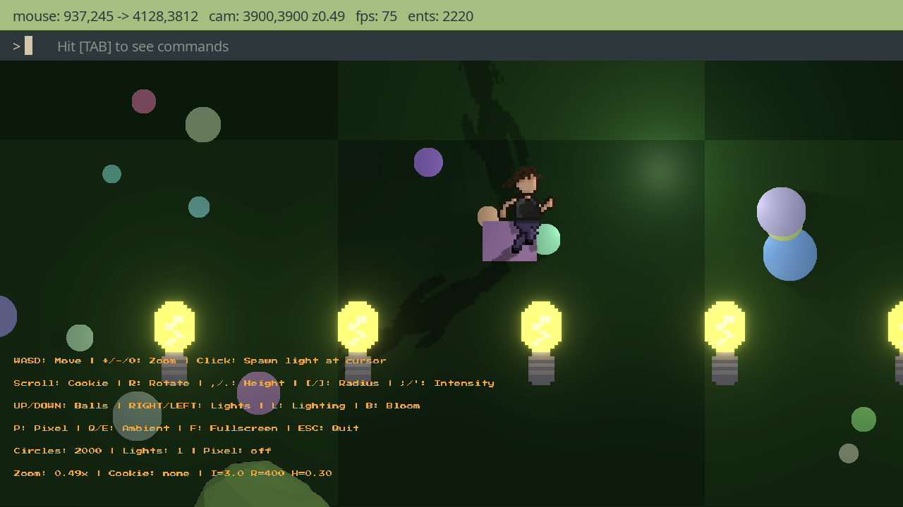
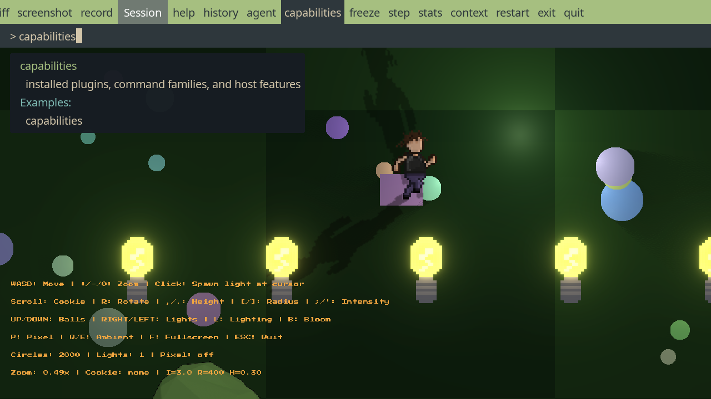
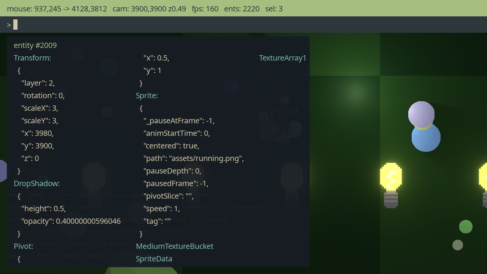
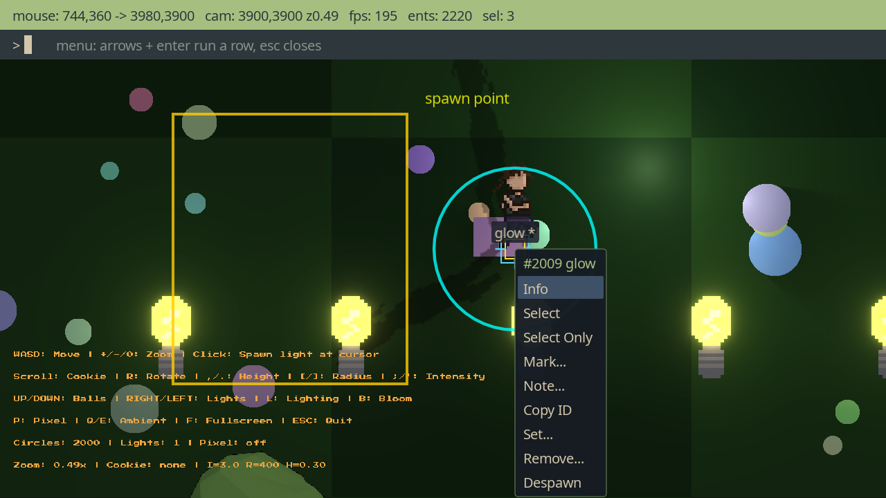
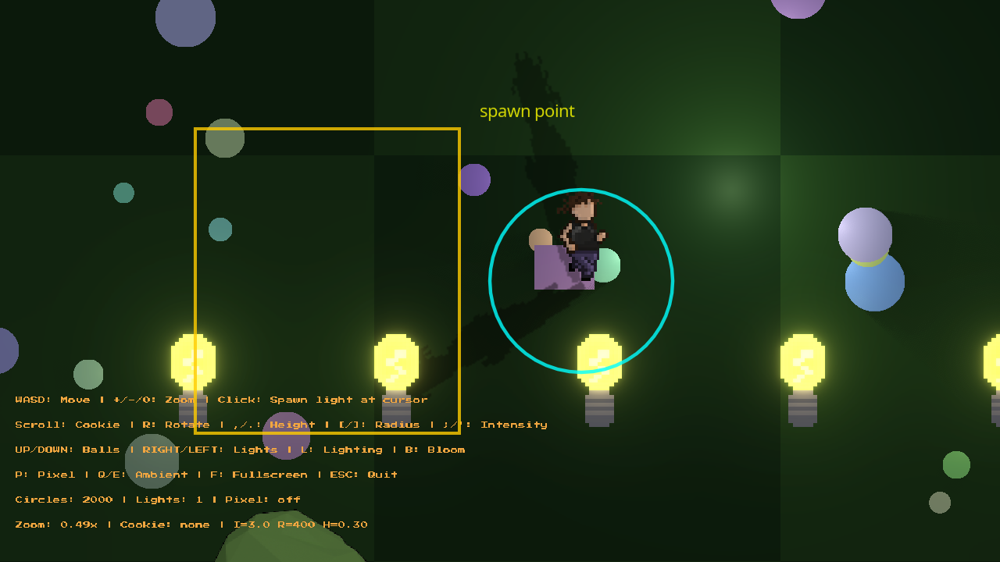
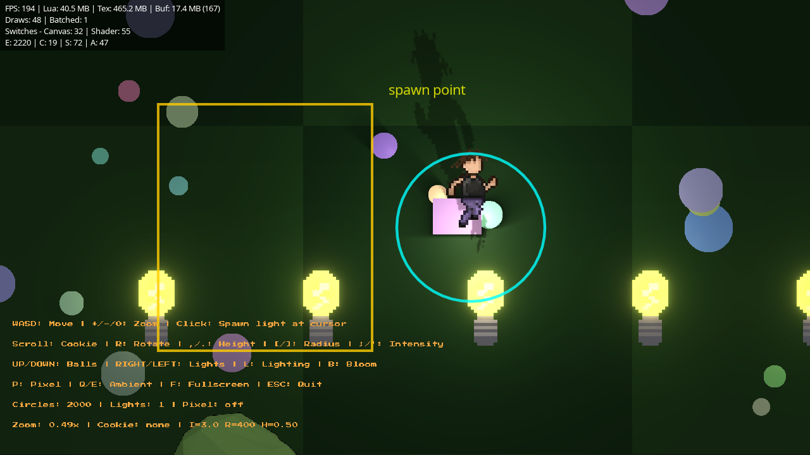

# Debug plugin

The `tecs2d.debug` plugin adds an in-game debugging surface to a running game: a
modal debugger overlay for inspecting and manipulating the world, and a stats
HUD for performance metrics. When the [MCP plugin](./mcp/) is also present, an
AI agent reads and drives the same debugger through MCP tools.

## Getting started

Add the plugin to your world. Debug mode is enabled automatically; there is no
separate flag to set.

```teal
local tecs = require("tecs")
local tecs2d = require("tecs2d")
local debug = require("tecs2d.debug")

local function gamePlugin(world: tecs.World)
    world:addPlugin(debug.new())

    -- Your game systems...
end

love.run = tecs2d.run({ fps = 60, game = gamePlugin })
```

With the plugin installed:

- **Ctrl+/** opens the modal debugger and freezes the game.
- **Ctrl+.** toggles the stats HUD while normal gameplay owns input.

## Modal debugger

Press **Ctrl+/** to open the debugger. Opening it freezes the game: every
gameplay phase is disabled and the render time scale is set to zero, so
animation and simulation stop while input and the overlay keep running. Pressing
Ctrl+/ again, pressing Escape on an empty prompt, or running `exit` closes it
and resumes the game.

The debugger also pushes a stable `"debugger"` [input layer](/tecs2d/input/#input-layers). While it is open, keyboard,
pointer, wheel, text, touch, and controller interaction belongs to the overlay; gameplay and any lower menu layer are
suppressed. Closing the debugger pops that exact layer and restores whichever owner is now beneath it.

The debugger layer is runtime-only (`snapshot = false`). Snapshot loads can replace the game-owned input layers under
an open debugger, but never close or restore the debugger itself. Closing it after a load reveals the input owner from
the loaded game.

Input capture and freezing are separate mechanisms. The debugger does not push a game state, tag or despawn entities,
or assume that the game uses the [state stack](/tecs/states). Its Ctrl+/ shortcut uses `input.raw`, so it can always
open above a game-owned modal and always close itself. The overlay's ordinary controls use its routed layer.

The overlay draws two rows across the top of the screen. The upper row is an
always-visible command toolbar: every colored-text section header and every
command appears in one horizontally scrollable strip. The lower row is a
command line with a short summary of the current command. A compact
mouse/world/camera readout sits at the bottom-right.



### A first session

1. Press **Ctrl+/**. The game freezes and the command line opens.
2. Click a command or press **Tab** to browse. Every section and its commands
   stays expanded in the toolbar; section headers jump to that section's first
   command. Keep tabbing, click a command, or type to narrow; Enter runs the
   line. The command line shows a short summary without covering the game.
   Press **F1** when you want the current command's full usage.

   

3. Click an entity to select only it, or drag a box to replace the selection
   with everything inside. Hold Shift while clicking or dragging to add. The
   selection is highlighted in the world.
4. Type `info` and press Enter: the selected entity's components appear as a
   paged popup (Left/Right page long output).

   

5. Escape clears the popup and prompt; Escape on an empty prompt (or Ctrl+/)
   closes the debugger and resumes the game.

### Bindings and controls

The leader key is **Ctrl** by default. `leaderKey`, `debugToggleKey`, and
`statsToggleKey` can be changed in the plugin configuration.

| Keyboard | Action |
| --- | --- |
| Ctrl+/ | Open or close the debugger; opening freezes the game |
| Ctrl+. | Toggle the stats HUD while normal gameplay owns input |
| Ctrl+C | Clear the command, completion cycle, and popup without closing the debugger |
| Ctrl+Y | Yank the last executed command's popup or message to the clipboard |
| Escape | Close the context menu; otherwise clear prompt state, or close the debugger when the prompt is empty |
| Enter / keypad Enter | Execute a non-empty command; activate the highlighted context-menu item |
| Tab / Shift+Tab | Cycle completions forward or backward; hold to repeat |
| F1 | Toggle full help for the current command; show debugger help when the prompt is empty |
| Up / Down | Browse command history; move through an open context menu |
| Left / Right | Page through a multi-page popup |
| Backspace | Delete the last command-line character; hold to repeat after a short pause |
| Delete | Despawn every selected entity |

| Pointer | Action |
| --- | --- |
| Left-click | Replace the selection with the entity under the cursor; empty space clears it |
| Shift+left-click | Add the entity under the cursor to the selection |
| Left-drag and release | Replace the selection with every entity inside the box |
| Shift+left-drag | Add every entity inside the box to the selection |
| Ctrl+left-drag | Move the current selection; right-click cancels and restores the original positions |
| Right-click | Open the context menu for the entity or empty world position under the cursor |
| Context-menu hover/click | Highlight and activate an item; clicking outside or right-clicking closes the menu |
| Middle-drag | Pan the camera |
| Wheel | Zoom toward the cursor |

The entity context menu includes info, selection, marks, notes, copy ID, set,
remove, and despawn actions. The empty-space menu includes copy position, spawn,
draw marker, physics query, and tile inspection actions.

Selected entities are highlighted in the world. Plain clicks and box drags
replace the set; hold Shift to add without clearing the existing selection.

### Command syntax {#command-syntax}

A command line is a name, an optional subcommand verb, and arguments:

```text
select 42                        positional argument
select 42 replace                boolean flag, bare
camera move z=0.3                key=value, any order after the positionals
mark "big boss"                  quotes keep spaces in one value
set 42 Transform {x = 100}       component values are Lua tables in braces
note flickers when lit           free-text tails need no quotes
```

- Arguments are positional or `key=value`; positional ones come first.
- Boolean flags are bare (`replace`) or explicit (`replace=false`; `on`, `off`,
  `yes`, and `no` work too).
- Entity targets accept an id or a mark name (edit commands also take
  `@selection`). A numeric token always resolves as an id, which is why mark
  names cannot be purely numeric.
- Commands with a free-text tail (`note`, `query`, `set`) consume the rest of
  the line; declared flags still parse after the text.

As you type or select a command, its short summary appears beside the prompt
without opening a panel. Press F1 to toggle its full generated usage;
`help <command>` opens the same details explicitly, and F1 on an empty prompt
opens the general debugger help. Tab completes command names, verbs, and
per-argument sources such as component names, marks, systems, and cameras.
Subcommand and argument candidates temporarily take over the top toolbar and
remain clickable; the grouped command toolbar returns when completion ends. On
an empty line the cycle starts at the last used command, so Tab-Enter repeats
recent work. History persists across sessions in the save directory (Up/Down
browses it, `history` lists it, `history clear` forgets it).

### Commands

Commands are grouped into colored sections: **Select**, **Edit**, **Render**,
**Engine**, **Capture**, and **Session** (plus **Custom** for commands the
game registers). The same grouping structures `help`, the Tab-completion
strip, and the generated [Command Reference](./debug-reference), which
documents every command's signature, arguments, examples, result schema, and
MCP projection. The sections below walk the main workflows instead of
repeating that reference.

### Marks and notes

Marks name a group of entities and notes attach a message to them. Both survive
until the entities are despawned.

```
select 42        # add entity 42 to the selection
mark boss        # name the whole selection "boss"
goto boss        # move the camera to the first entity marked "boss"
note flickers when hit
```

`mark list` (or `mark ls`) pops up the list of marks, each with its entity
count and first id, so you can see what is available. Running `mark` or `note`
with no argument clears the mark or note on the current selection. Mark names
cannot be purely numeric, since numbers resolve to entity ids everywhere a
target is accepted.

Marked and noted entities carry a small label in the world (the mark name, plus
`*` when a note is present) so it is visible which entities are annotated.
Right-clicking an entity opens the context menu with the same actions:



### Queries

`query` selects every entity matching a component expression. Each token names a
component:

| Token | Meaning |
| --- | --- |
| `Foo` | Must have `Foo` |
| `-Foo` | Must not have `Foo` |

For example:

```text
query Position Velocity -Dead
```

selects entities that have `Position` and `Velocity` and not `Dead`. The matches
are added to the current selection. `invert=true` refines instead of adding: it
de-selects the currently selected entities that match the expression, so
`query Dead invert=true` drops the dead ones from your selection.

### Editing entities

`set`, `remove`, and `spawn` edit the world directly. Their target is an entity
id, a mark name, or the literal `@selection`; component values are Lua table
expressions (easier to type than JSON), evaluated with the same trust as
`run_lua`:

```text
set 42 Transform {x = 100, y = 50}
set @selection Color {r = 1, g = 0, b = 0}
remove @selection Burning Stunned
spawn Transform {x = 160, y = 120} Sprite {sheet = "player"}
spawn enemy Transform {x = 0, y = 0}
```

`spawn` accepts an optional leading bundle name, then component name / value
pairs (a bare component name uses its defaults); the new entity is added to the
selection. Agents call the same actions as `cmd_set`, `cmd_remove`, and
`cmd_spawn`, passing the value expression as a string.

### Annotations and id labels

`draw` places world-space shapes and text over the game, drawn every frame
whether the panel is open or not:

```text
draw rect 10 10 64 48 tag=zone
draw circle 0 0 20 entity=42 r=0 b=1
draw text 5 -30 spawn point here seconds=10
draw clear zone
```



Every verb takes color channels (`r= g= b= a=`), a `tag` for grouped clearing,
`seconds` for a wall-clock expiry (0 = one frame), `stroke` for outline width, and
`entity` to pin the annotation to an entity: positions become offsets from its
Transform and the annotation is removed when the entity dies. Durations use
wall-clock time, so annotations appear and expire even while the game is
frozen. Agents draw through the `cmd_draw_*` tools.

`ids` toggles small entity-id labels over every on-screen entity (capped at
200 labels), so ids can be read off the screen and used in commands.

### Cameras, systems, and time

`camera` shows the camera position, zoom, rotation, and time scale plus every
registered camera; `camera move [x y] [r] [z]` repositions it, with omitted
parameters keeping their current values (`camera move z=0.3` zooms in place;
a named camera via `name=`), `camera timescale 0.5` sets the game speed (applied on unfreeze
when set while frozen), and `camera toggle <name>` flips a named camera's
active flag.

`systems` lists every system with its phase and state; `systems stop <name>` /
`systems start <name>` / `systems toggle <name>` gate one by name (useful for
bisecting a rendering or gameplay bug live), and `systems info <name>` shows
its phase, order, and state.

### Profiling

`profile` samples the running game with the LuaJIT sampler. Because the game
must run to be sampled, `profile` closes the debugger (unfreezing the game) and
starts a session:

- `profile <seconds>` samples for that long, then reopens the debugger with the
  results: the saved file, the top 10 hot spots by self-samples (each labeled
  with the zone it ran in), and the top 10 systems by inclusive samples
  (every system runs in its own sampler zone, so per-system CPU share falls
  out of the same capture).
- `profile` with no duration samples until you reopen the debugger yourself
  (Ctrl+/), which stops the session and shows the results.

The collapsed-stack file (loadable in speedscope) is written to the game's
working directory, and its path plus the top frames are published to the debug
context for the agent. `profile info [name|index]` re-generates the summary
for any past capture (the latest if omitted), and `profile open [name|index]`
opens [speedscope](https://www.speedscope.app/) in the browser with the
capture's absolute path copied to the clipboard, ready to paste into the
file picker.

### Snapshots

`snapshot save [name]` writes the whole world to the game's save directory and
reports a save number; `snapshot load [name|number]` restores it (loading
clears the selection, marks, and notes since entity ids change). With no
argument, `save` auto-names by number and the other verbs use the most recent
save. Every capture family (snapshots, profiles, screenshots, diffs,
recordings) shares the same bookkeeping verbs: `list`, `info`, `open`, `path`
(copies the absolute path to the clipboard), and `clear`; see the
[Command Reference](./debug-reference#capture) for each family's details.

### Time travel

`rewind start [interval=5] [cap=10]` keeps a rolling ring of world snapshots
under `debug-rewind/` in the save directory, captured on wall-clock intervals.
Capture never runs while the freeze controller is held (the debugger is open,
an agent paused the game, or a recording countdown froze it), so freezing to
investigate cannot churn the ring and evict the history you came for.

When something goes wrong: freeze, `rewind list` to see the ring newest first
(age, timestamp, size, entity count), then `rewind load 3`, `rewind load
latest`, or `rewind load ago=10` (shorthand: `rewind load 10s`) to restore
the closest capture at or before that age. Loading clears the selection, marks, and notes, and pauses capture
(reason `loaded`) so the ring stops overwriting the timeline; `rewind resume`
continues it. `rewind keep <ref> [name]` copies an entry into the normal
snapshot history with a snapshot number, preserving its capture time. `rewind
stop` ends the session but keeps the ring; `start` refuses to overwrite a
stopped ring (`keep` what you need, then `rewind clear`). `rewind info` shows
the session state, window, total bytes, and the last capture's cost in
milliseconds: captures serialize the whole world on the main thread, so heavy
worlds should prefer longer intervals.

A typical flow:

```text
rewind start 2 30        60-second window, capturing quietly
...bug happens...
Ctrl+/                   freeze; captures hold automatically
diff rewind:10s ignore=Transform    what changed in the last 10 seconds?
rewind load ago=10       jump to just before it went wrong
step 30                  replay toward the bug frame by frame
rewind keep latest before-bug
```

### Diffing timelines

`diff <from> [to]` compares any two moments structurally: `from`/`to` are a
snapshot number, filename, or `latest`; `rewind:<idx|latest|Ns|ago=N>`; or
`current` (the default for `to`). Binary refs decode through a throwaway
scratch world, so a diff never mutates the live world, the selection, or the
rewind state, and decoded snapshots are cached for the session so refiltering
the same pair is cheap.

Results are normalized by entity id and component name (archetype order can
never produce false differences) and reported as add/remove/replace changes
with JSON Pointer paths. The summary always covers the complete diff, per
component, even when the detailed list is truncated by `limit=` (0 = summary
only). Filters narrow both: `entity=<id|mark|@selection>`,
`component=Health`, `ignore=Transform,Velocity` (the usual first move on a
live game, where positions drift constantly), and `epsilon=0.001` for numeric
tolerance. Custom snapshot-handler data is skipped symmetrically and noted in
the result.

Every run writes the full result to `debug-diff-N.json` in the save dir
(`diff ls`/`open`/`path`/`clear` manage them), and `diff get <pointer> [ref]`
dereferences an RFC 6901 pointer into the last diff or a saved one:
`diff get /summary/byComponent`, `diff get /changes/0/after`. Filters select;
pointers dereference.


### Screenshots

`screenshot [name]` captures the frozen screen to a PNG in the game's save
directory. The debugger chrome is hidden for that one frame so the shot is the
game only; `panel=true` keeps it visible, `delay=n` defers the capture (the
two pair well for shots of the debugger itself, which is how the images on
this page were taken), and an active drag area crops the shot to that region.
`screenshot info` shows a capture's details with a scaled thumbnail.

### Recordings

`record start [seconds] [name] [fps=30] [scale=1] [countdown=N] [debug]` arms a
recording. The
debugger shows a countdown, then closes and unfreezes gameplay so the debug
overlay is not in the capture. Untimed recordings stop when the debugger is
reopened or when `record stop` is run. Timed recordings keep running if the
debugger is reopened, so you can capture the debug panel; they stop when the
duration expires or when `record stop` is run. `stopOnDebugOpen=true|false`
overrides that default explicitly. `record cancel` cancels an armed countdown.
`record status`, `record list`, `record info [name|latest]` (path, size,
duration, stop reason, log location), and `record open [name|latest]` inspect
and open recordings.

`fps` sets the capture rate and `scale` sets the output resolution multiplier
(for example `scale=0.5` records at half resolution). Both fall back to the
plugin defaults (`recordingFps`, `recordingScale`).

Pass `debug` (or `debug=1`) to record the debugger itself, for instructional
videos: the debugger stays open and interactive during the recording, and,
unlike opening it normally, the game keeps running instead of freezing. So you
can pan and zoom the camera, show live lighting and animation, and select
entities or run commands with the overlay on camera. The captured frames include
the debug overlay. When the recording ends, an open panel re-freezes the game as
usual.

Recording captures the game's own framebuffer each frame and hands it to a
worker thread that writes numbered images to disk; on stop, a single `ffmpeg`
pass assembles the video and deletes the intermediates. It needs no macOS
Screen Recording permission, works headless, and captures exactly the window;
`ffmpeg` must be on `PATH` and the pipeline shells out POSIX-style, so host
recording is macOS and Linux only. Frames beyond the in-flight ring
(`recordingRingSize`, default 8) are dropped rather than stalling the game
loop, and the video is assembled at the rate actually achieved, so drops show
up as choppiness, never as a fast-forwarded clip. If a recording comes out
choppy (likely on high-DPI displays, where frames are several times larger),
lower the capture rate (`fps=15`) or switch to a faster image format
(`recordingFrameFormat = "tga"`).

## Stats HUD

The **Ctrl+.** stats shortcut uses the normal base input target. A modal input layer—including the open
debugger—suppresses it, so typing in a menu or debugger cannot accidentally toggle the HUD. The debugger's Ctrl+/
shortcut is the intentional always-on exception.

When visible, the HUD samples once per second and shows:

- **FPS**: current frames per second
- **Lua**: Lua heap memory in MB
- **Tex** / **Buf**: GPU texture and buffer memory (with buffer count)
- **Draws** / **Batched**: draw calls this frame and how many batched
- **Canvas** / **Shader** switches: render-target and shader-program changes
- **E / C / S / A**: entities, component types, systems, and archetypes



## Configuration

```teal
local debug = require("tecs2d.debug")

world:addPlugin(debug.new({
    -- Modifier held with a toggle key: "ctrl" (default), "alt", "shift",
    -- or "gui"/"cmd"/"super".
    leaderKey = "ctrl",

    -- Key that, with the leader, toggles the modal debugger (default "/").
    debugToggleKey = "/",

    -- Key that, with the leader, toggles the stats HUD (default ".").
    statsToggleKey = ".",

    -- Seconds between graphics/world stat samples (default 1).
    sampleFrequency = 1,

    -- Seconds between Lua heap-size samples (default 8).
    gcFrequency = 8,

    -- ffmpeg executable path/name, used to assemble frames (default "ffmpeg").
    recordingFfmpegPath = "ffmpeg",

    -- Save-directory subfolder for recording outputs (default recordings).
    recordingOutputDir = "recordings",

    -- Countdown before recording starts (default 3).
    recordingCountdown = 3,

    -- Default capture frame rate (default 30).
    recordingFps = 30,

    -- Default output scale multiplier (default 1).
    recordingScale = 1,

    -- Captured image format: "png" (default), "tga", or "jpg".
    recordingFrameFormat = "png",

    -- Max frames in flight before dropping (default 8).
    recordingRingSize = 8,
}))
```

## Agent integration

The [Runtime introspection](./introspection) guide explains the complete
human-agent workflow. To expose this debugger to an AI agent, add the
[MCP plugin](./mcp/) alongside it:

```teal
world:addPlugin(require("tecs2d.mcp").new())
world:addPlugin(require("tecs2d.debug").new())
```

The debug plugin publishes a `DebugContext` resource, and the MCP server reads
and drives it:

- **`cmd_context`** returns the open and frozen state, the current
  command, the last message, the selection, the entity count, the stats HUD
  visibility, any drag area, and the marks and notes.
- The debugger's commands are projected as **`cmd_*` tools**. Every command
  is declared once (schema, help, subcommands, action) in a shared registry;
  the overlay dispatches typed command lines through it, and the MCP server
  exposes the same registry with JSON schemas generated from the command
  schemas. The [MCP Tools](./mcp/tools) page carries the generated index of
  every projected tool, and the [Command Reference](./debug-reference)
  documents each one.

A command called over MCP runs the same validation and produces the same
effects as the typed command, including the on-screen highlights.

Pausing is shared: the debugger's freeze and the `cmd_freeze` tool go through
one freeze controller, so an agent freeze survives the operator opening and
closing the debugger, and `cmd_step` works no matter which side froze the
game.

Agents follow what the operator does through the log feed: every action
(selection changes, marks, notes, edits, spawns, artifact writes, panel
open/close) logs a `kind key=value ...` line under `tecs2d.debug.events`, and
**`get_logs`** reads it back with a seq cursor
(`{after = <last seq>, contains = "debug.events"}`). Pair it with
**`cmd_components_info`** (field names, C types, and defaults for building
`cmd_set` / `cmd_modify` payloads); see the [MCP tools](./mcp/tools) page and
the [Command Reference](./debug-reference).

`cmd_context` also carries the session's `snapshots`, `profiles`,
`screenshots`, current `recording` state, and completed `recordings`. These
lists are capped to the five most recent entries so a long session does not
ship an unbounded history each call.
Snapshots, profiles, screenshots, and recordings include `path`, `size`, and
`time`; snapshots also carry a `number`. Writing snapshots, profiles, or screenshots
emits an `OnDebugContext` event (to address 0, with `kind`, `path`, and
`number`) that game systems can observe.

Marks and notes are returned keyed by name or message, with the entity ids
encoded as a compact range string. A group of contiguous ids becomes `"8-12"`
and a single entity becomes `"5"`, so large named groups stay cheap to ship to
the agent:

```json
{
  "marks": { "boss": "8-12,20" },
  "notes": { "flickers when hit": "8" }
}
```

A typical workflow is to run the game in a window, connect an agent to the MCP
server, click or drag to select entities in-game, and let the agent read the
selection and the notes to reason about what is on screen.
