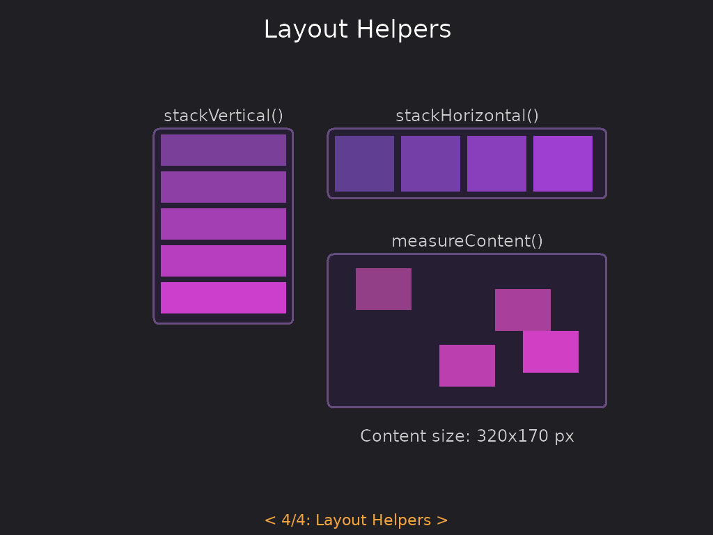

# Layout Helpers

Utility functions for common layout patterns.

<p align="center">
<br/>
<em>See the <a href="https://github.com/tecs-dev/tecs/tree/main/examples/tecs-ui">tecs-ui example</a>.</em>
</p>

## stackVertical

Position children in a vertical stack:

```teal
local ui = require("tecs2d.ui")

-- Stack with 10px spacing, starting at Y=0
ui.stackVertical(world, {child1, child2, child3}, 10)

-- Stack starting at Y=50
ui.stackVertical(world, children, 10, 50)
```

Children must have `RelativeTransform` and optionally `LayoutBox` components. The function updates each child's
`RelativeTransform.y` based on the cumulative heights of preceding children.

## stackHorizontal

Position children in a horizontal row:

```teal
-- Row with 10px spacing, starting at X=0
ui.stackHorizontal(world, {child1, child2, child3}, 10)

-- Row starting at X=20
ui.stackHorizontal(world, children, 10, 20)
```

## measureContent

Calculate the bounding box of children:

```teal
local width, height = ui.measureContent(world, children)
```

Returns the total width and height needed to contain all children based on their `RelativeTransform` positions and
`LayoutBox` dimensions. Useful for sizing containers to fit their content.
