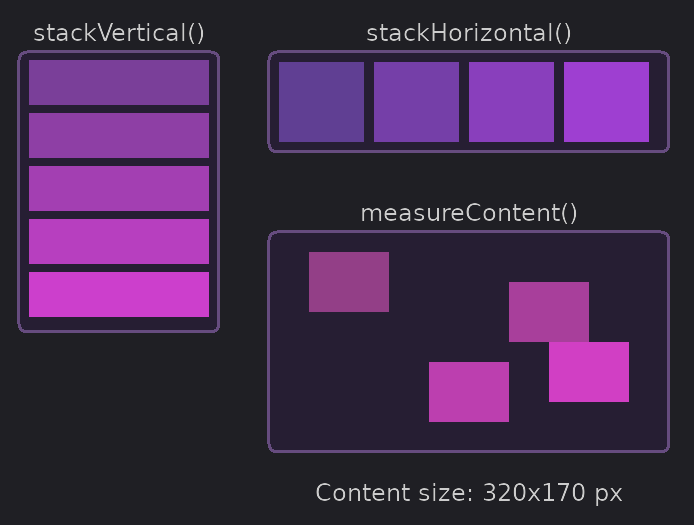

# Tecs UI



Tecs UI provides building blocks for creating UI systems in Tecs. It's designed to enable custom layout engines rather
than being a complete UI framework.

- **Viewport-relative anchoring** - Position elements relative to screen/viewport edges
- **Origin-based positioning** - Components can have configurable origins (top-left, center, etc.)
- **Dynamic dimensions** - LayoutBox can pull dimensions from render components automatically
- **Scrollable containers** - LayoutNode provides clipping and scrolling
- **Helper functions** - Simple utilities for common layout patterns

## Quick Example

```teal
local tecs = require("tecs")
local tecs2d = require("tecs2d")
local ui = require("tecs2d.ui")
local gfx = require("tecs2d.gfx")

local Transform = tecs.builtins.Transform
local ChildOf = tecs.builtins.ChildOf
local RelativeTransform = tecs.builtins.RelativeTransform
local LayoutBox = ui.LayoutBox
local LayoutNode = ui.LayoutNode

-- Create a scrollable panel with top-left origin
local panel = world:spawn(
    Transform(50, 50),
    gfx.Rectangle(300, 400),
    LayoutBox(gfx.Rectangle, nil, 0, 0),  -- top-left origin
    LayoutNode(0, 0, 300, 800)  -- scrollable content
)

-- Add child elements
for i = 1, 10 do
    world:spawn(
        ChildOf(panel),
        RelativeTransform.new({x = 10, y = (i - 1) * 50}),
        gfx.Text(font, "Item " .. i),
        LayoutBox(gfx.Text)
    )
end
```

## Modules

- [Anchor](./anchor) - Viewport-relative positioning
- [LayoutBox](./layoutbox) - Dimensions and origin for UI positioning
- [LayoutNode](./layoutnode) - Scrollable containers with clipping
- [FitContent](./fitcontent) - Auto-size containers to fit children
- [Helpers](./helpers) - Layout helper functions
