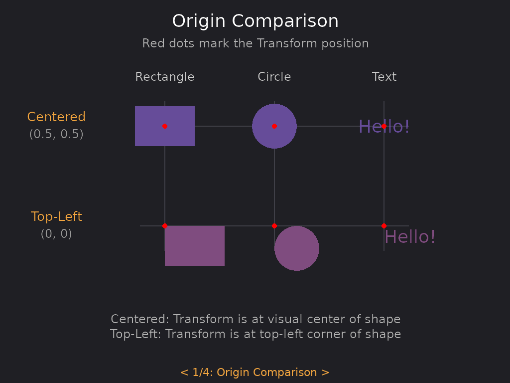
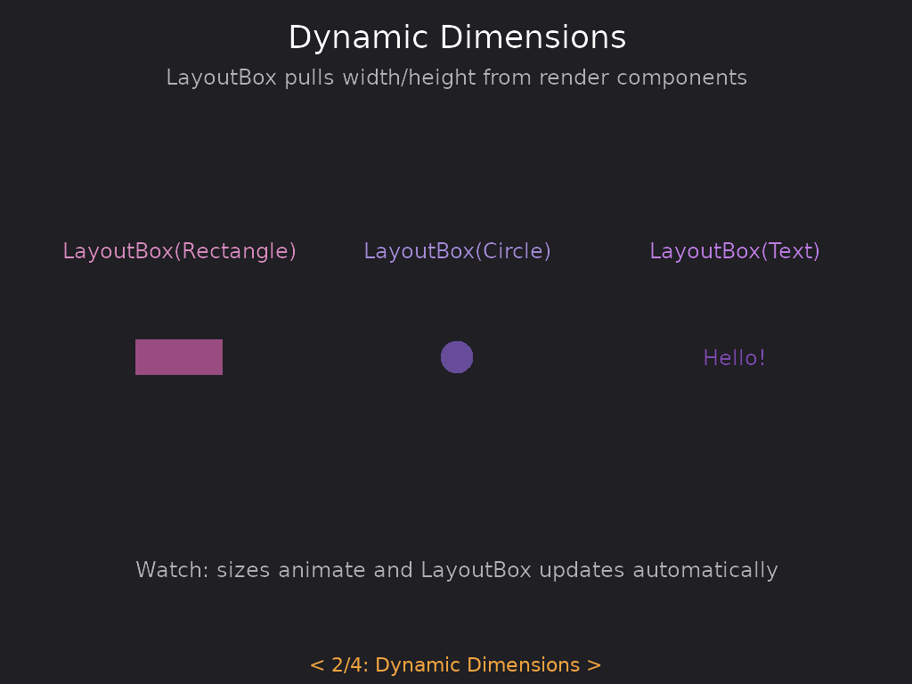

# LayoutBox

Defines layout dimensions and origin for UI positioning. Supports both fixed dimensions and dynamic dimensions from
render components.

## Basic Usage

```teal
local ui = require("tecs2d.ui")
local LayoutBox = ui.LayoutBox

-- Fixed dimensions (centered by default)
world:spawn(
    Transform(100, 100),
    Rectangle(50, 30),
    LayoutBox(50, 30)
)

-- Dynamic dimensions from a render component
world:spawn(
    Transform(100, 100),
    Rectangle(50, 30),
    LayoutBox(Rectangle)  -- Pulls width/height from Rectangle
)

-- Top-left origin (for UI elements)
world:spawn(
    Transform(100, 100),
    Rectangle(50, 30),
    LayoutBox(Rectangle, nil, 0, 0)  -- originX=0, originY=0
)
```

## Fields

| Field               | Type    | Description                                 |
| ------------------- | ------- | ------------------------------------------- |
| `width`             | number  | Width of the entity for layout              |
| `height`            | number  | Height of the entity for layout             |
| `offsetX`           | number  | Computed offset from origin                 |
| `offsetY`           | number  | Computed offset from origin                 |
| `originX`           | number  | Origin X (0-1). 0=left, 0.5=center, 1=right |
| `originY`           | number  | Origin Y (0-1). 0=top, 0.5=center, 1=bottom |
| `sourceComponentId` | integer | Component to pull dimensions from (0=fixed) |

## Origin System

The origin determines where the entity's reference point is:

- `(0.5, 0.5)` - Centered (default, backward compatible with games)
- `(0, 0)` - Top-left (typical for UI elements)
- `(1, 1)` - Bottom-right
- `(0, 0.5)` - Left-center

<p align="center">
<br/>
<em>See the <a href="https://github.com/tecs-dev/tecs/tree/main/examples/tecs-ui">tecs-ui example</a>.</em>
</p>

The red dots mark the Transform position. With centered origin (top row), the Transform is at the visual center of each
shape. With top-left origin (bottom row), the Transform is at the top-left corner.

```teal
-- Centered origin (default)
LayoutBox(100, 50)            -- originX=0.5, originY=0.5
LayoutBox(Rectangle)          -- originX=0.5, originY=0.5

-- Top-left origin
LayoutBox(100, 50, 0, 0)      -- originX=0, originY=0
LayoutBox(Rectangle, nil, 0, 0)

-- Custom origin
LayoutBox(100, 50, 1, 0.5)    -- right-center
```

When using `LayoutBox(Rectangle)` or similar, the component's `getRect()` provides dimensions, and the offset is
computed from the origin you specify.

## Dynamic Dimensions

LayoutBox can automatically extract dimensions from any component that implements `getRect()`:

<p align="center">
<br/>
<em>See the <a href="https://github.com/tecs-dev/tecs/tree/main/examples/tecs-ui">tecs-ui example</a>.</em>
</p>

```teal
-- These all work:
LayoutBox(Rectangle)
LayoutBox(Circle)
LayoutBox(Text)
LayoutBox(Sprite)
```

The dimensions are updated each frame by the ComputeLayoutBox system, so changes to the source component are reflected
automatically. This is useful for animated elements or text that changes at runtime.