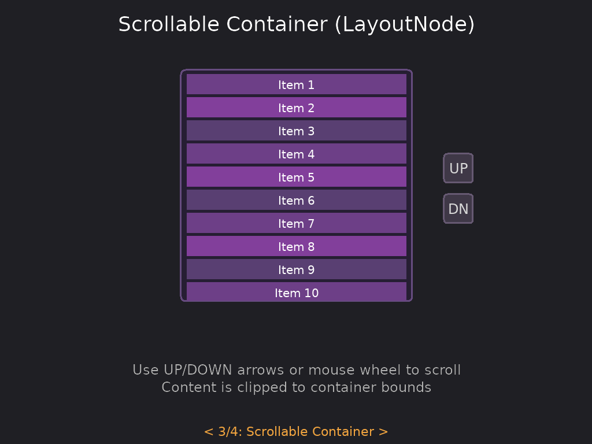

# LayoutNode

A container that provides clipping and scrolling for its children. Requires LayoutBox for dimensions.

## Basic Usage

```lua
local ui = require("tecs2d.ui")
local LayoutNode = ui.LayoutNode
local LayoutBox = ui.LayoutBox

-- Create a scrollable container
local container = world:spawn(
    Transform(50, 50),
    Rectangle(200, 300),
    LayoutBox(Rectangle, nil, 0, 0),  -- Top-left origin
    LayoutNode(0, 0, 200, 600)  -- scrollX, scrollY, contentWidth, contentHeight
)
```

## Fields

| Field           | Type   | Description              |
| --------------- | ------ | ------------------------ |
| `scrollX`       | number | Horizontal scroll offset |
| `scrollY`       | number | Vertical scroll offset   |
| `contentWidth`  | number | Total content width      |
| `contentHeight` | number | Total content height     |

## Constructor

```lua
LayoutNode(scrollX, scrollY, contentWidth, contentHeight)
```

All parameters are optional and default to 0.

## Requirements

LayoutNode **requires** a LayoutBox component on the same entity. An error is thrown if LayoutBox is missing:

```lua
-- This works
world:spawn(
    Transform(0, 0),
    Rectangle(200, 300),
    LayoutBox(Rectangle),
    LayoutNode(0, 0, 200, 600)
)

-- This throws an error
world:spawn(
    Transform(0, 0),
    LayoutNode(0, 0, 200, 600)  -- Error: LayoutNode requires LayoutBox
)
```

## Scrolling

Children of a LayoutNode are clipped to its bounds and offset by the scroll values:

<p align="center">
<br/>
<em>See the <a href="https://github.com/tecs-dev/tecs/tree/main/examples/tecs-ui">tecs-ui example</a>.</em>
</p>

```lua
-- Update scroll position
local layoutNode = world:get(containerId, LayoutNode)
layoutNode.scrollY = layoutNode.scrollY + 10  -- Scroll down 10 pixels

-- Clamp to valid range
local layoutBox = world:get(containerId, LayoutBox)
local maxScroll = math.max(0, layoutNode.contentHeight - layoutBox.height)
layoutNode.scrollY = math.max(0, math.min(layoutNode.scrollY, maxScroll))
```